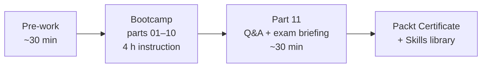

# Claude Code Bootcamp — Build 10 Real-World Projects with Claude Code

> **Packt Certification** · part of **LLM Engineering by Packt**
> A 5-hour live virtual bootcamp by **Luca Berton** — Claude Code Certified Expert Instructor · AI-first Developer · Author & Educator
> **Inaugural delivery:** 30 May 2026, 09:00 AM EST · Live, Virtual & Practical

[](#schedule)
[](#schedule)
[](#audience)
[](slides/README.md)
[](skills/README.md)

---

## Start here

> **Where do I start?** → Open [exercises/part-01/README.md](exercises/part-01/README.md). Everything else on this page is reference material.

**Pre-work checklist** (complete before the live session — ~30 min):

- [ ] **Claude Code** installed and signed in (any tier)
- [ ] **Python 3.11+** on `PATH` (primary track)
- [ ] **Node.js 20+** on `PATH` (secondary track for parts 2/4/5)
- [ ] **Git ≥ 2.30** on `PATH`
- [ ] An IDE you can drive (VS Code recommended)
- [ ] macOS / Linux / Windows-via-WSL2 — native PowerShell is **not** supported

Full pre-work is in [student-guide.md](student-guide.md#mandatory-pre-work-30-min).

**During the bootcamp**, work through parts 01 → 10 in order. Each part is a ~22-minute block with a slide deck + an exercise + a reference solution. Part 11 is the closing Q&A + exam briefing.



## Table of Contents

- [Overview](#overview)
- [Audience](#audience)
- [Prerequisites](#prerequisites)
- [Learning outcomes](#learning-outcomes)
- [Schedule](#schedule)
- [Projects](#projects)
- [Repository layout](#repository-layout)
- [Build](#build)
- [Assessment](#assessment)
- [License](#license)

---

## Overview

Most developers use AI as autocomplete. This bootcamp teaches you to use **Claude Code** as a development partner — one that plans, codes, tests, reviews, refactors, and documents alongside you. Across **10 hands-on projects** in a single afternoon you will ship a CLI, a REST API, a test suite, a UI from a wireframe, a refactor with handoff docs, a Git workflow, a personal skills library, and a production readiness review.

You leave with: a portfolio of 10 deliverables, a reusable Claude Skills library (10+ skills, MIT-licensed), and a **Packt Certification** Certificate of Completion.

## Audience

- Beginner-to-intermediate developers
- Tech leads adopting AI-assisted workflows
- DevOps and automation engineers
- AI-first builders moving from prompts to shipped software

## Prerequisites

- Basic programming literacy in any language
- Git basics (`clone`, `branch`, `commit`, `push`)
- Working **Claude Code** access (any tier)
- macOS / Linux / Windows-via-WSL2 — native PowerShell is not supported
- Python 3.11+ (primary track) and Node.js 20+ (secondary track for modules 2/4/5)
- ~30 minutes of mandatory **pre-work** completed before the live session — see [`student-guide.md`](student-guide.md#mandatory-pre-work-30-min)

## Learning outcomes

By the end of the bootcamp you can:

1. Drive Claude Code through plan → implement → test → review → commit loops
2. Write a `CLAUDE.md` brain file that gives Claude project context
3. Generate, evaluate, and select Best-of-N implementations
4. Generate test suites and detect AI-generated bugs
5. Run AI-assisted Git feature-branch workflows safely
6. Convert a wireframe into a working UI via multimodal prompts
7. Refactor a module under constraints and ship handoff docs
8. Author reusable Claude Skills and slash commands
9. Produce a 5-axis production readiness report
10. Self-review AI output against a Code Review Rubric you author

## Schedule

5 hours total = **4h instruction (240 min) + 1h breaks/Q&A/exam briefing (60 min)**.

| # | Module | Time (min) | Deliverable |
|---|---|---:|---|
| 1 | Welcome, Setup & AI-First Mindset | 20 | AI Coding Workspace |
| 2 | Prompting Like a Tech Lead | 24 | CLI Task Manager |
| 3 | Project Context with CLAUDE.md | 22 | Project Brain File |
| 4 | Build Faster with Best-of-N | 30 | Notes App API |
| 5 | Testing, Debugging & Self-Review | 28 | Tests + Bug Fixes + **Code Review Rubric** |
| 6 | Git Workflows for Safe AI Dev | 22 | Feature Branch Workflow |
| 7 | Multimodal: Screenshot to UI | 30 | Dashboard UI |
| 8 | Refactoring & Documentation at Scale | 24 | Refactor + Handoff Docs |
| 9 | Commands, Hooks & Reusable Workflows | 22 | Personal Claude Skills / Command Library |
| 10 | Production Readiness | 18 | Production Readiness Report |
| | **Instruction total** | **240** | |
| 11 | Q&A, exam briefing, next steps (closing block) | 30 | Action plan for Monday |
| | Breaks + buffer | 30 | — |
| | **Schedule total** | **300** | |

## Projects

The 10 projects students build, in order:

1. **AI Coding Workspace** — repo + CLAUDE.md + first guided Claude Code run
2. **CLI Task Manager** — Python primary; Node.js secondary
3. **Project Brain File** — a real `CLAUDE.md` for an existing repo
4. **Notes App API** — Python (FastAPI + SQLite); Node.js (Hono + better-sqlite3)
5. **Tests + Bug Fixes + Code Review Rubric** — pytest + 2 bug fixes + a student-authored rubric
6. **Feature Branch Workflow** — feature branch + AI-generated commit + PR text
7. **Dashboard UI** — single-page UI rendered from a wireframe (Python)
8. **Refactor + Handoff Docs** — refactor a module + `HANDOFF.md` + `ARCHITECTURE.md` (Python)
9. **Personal Claude Skills / Command Library** — author at least one new SKILL.md
10. **Production Readiness Report** — 5-axis report on a prior project

> Module 5's "Code Review Rubric" is the **student-built deliverable** at [`exercises/part-05/code-review-rubric.md`](exercises/part-05/code-review-rubric.md). The **instructor grading rubric** lives at [`assessments/rubric.md`](assessments/rubric.md). They are different artifacts.

## Repository layout

```text
.
├── README.md                       # this file
├── LICENSE                         # CC BY-NC-SA 4.0 (course materials)
├── instructor-guide.md             # live-delivery + grading guide
├── student-guide.md                # student onboarding + pre-work + submission
├── certificate-template.md         # Packt Certification template
├── slides/                         # 10 Marp decks + build script
│   ├── README.md
│   ├── deploy-pptx.sh
│   └── part-01-…-part-10-….md (+ part-11 closing block)
├── exercises/                      # 10 hands-on labs (parts 01–10)
│   └── part-01/ … part-10/
├── skills/                         # MIT-licensed Claude Skills library (12 skills)
│   ├── LICENSE
│   ├── README.md
│   └── <12 skills>/SKILL.md
├── assessments/                    # quiz, practical, reflection, rubric, key
├── scripts/
│   ├── preflight.sh                # 15-gate pre-cohort audit
│   ├── check-slide-overflow.sh
│   ├── check-contrast.sh
│   └── check-verbatim-blocks.sh
├── archive/                        # off-agenda content (optional warm-up)
└── specs/                          # Spec Kit feature specs (maintainer-facing)
```

## Build

Build all 11 slide decks (10 modules + closing block) to PPTX (and optionally PDF/HTML):

```bash
cd slides
./deploy-pptx.sh            # PPTX only → slides/dist/pptx/
./deploy-pptx.sh --all      # PPTX + PDF + HTML → slides/dist/{pptx,pdf,html}/
./deploy-pptx.sh --pdf      # PPTX + PDF
./deploy-pptx.sh --clean    # remove dist/ before rebuilding
```

All decks build to a single flat tree under `slides/dist/<format>/` using the self-contained `wow-beginner` theme. See [slides/themes/README.md](slides/themes/README.md).

The script auto-detects a global `marp` and falls back to `npx --yes @marp-team/marp-cli@latest`. Set `CHROME_PATH` if Marp can't find Chromium for PPTX/PDF export. See [slides/README.md](slides/README.md).

### Run the audit

Before every cohort, run the pre-flight audit to catch broken cross-links, missing sections, drifted slide artefacts, and stray `[NEEDS CLARIFICATION]` tokens:

```bash
bash scripts/preflight.sh           # all 15 gates; RC=0 means safe to deliver
bash scripts/preflight.sh --quick   # skip the slow slide-overflow render
bash scripts/preflight.sh --gate audit.cross-links --verbose
```

Gate reference: [instructor-guide.md § Pre-delivery audit](instructor-guide.md#pre-delivery-audit).

## Assessment

| Component | Weight | Artifact |
|---|---:|---|
| Knowledge quiz | 40% | [`assessments/knowledge-quiz.md`](assessments/knowledge-quiz.md) |
| Practical task | 40% | [`assessments/practical-task.md`](assessments/practical-task.md) |
| Code review reflection | 20% | [`assessments/code-review-reflection.md`](assessments/code-review-reflection.md) |
| Pass threshold | **70%** | [`assessments/rubric.md`](assessments/rubric.md) |

Students who achieve ≥70% receive a **Packt Certification** Certificate of Completion issued from [`certificate-template.md`](certificate-template.md).

Submission workflow: students zip their deliverables (`module-00-prework/` + `module-01/` … `module-10/` + `assessments/`) and upload to the Packt LMS. Instructor grades locally — see [`instructor-guide.md`](instructor-guide.md).

## License

This repository uses a **dual-license** scheme:

- **Course materials** (this README, slides, exercises, guides, assessments, certificate template, scripts) — [CC BY-NC-SA 4.0](LICENSE). You may share and adapt for non-commercial use with attribution.
- **`skills/` directory** — [MIT](skills/LICENSE). Graduates may reuse skills in commercial projects without further restriction.

"**Packt Certification**" and "**LLM Engineering by Packt**" are trademarks of Packt Publishing Ltd., used here under endorsement.

## Optional pre-bootcamp warm-up (archived)

There is an earlier **beginner track** kept under [archive/beginner/](archive/beginner/README.md). It is **not** part of the 4-hour bootcamp and is not maintained on the May 2026 refresh path. Use it only as a self-study warm-up if you have never used Claude Code before. Instructors: do not point students here during a cohort.

---

**Instructor:** Luca Berton — Claude Code Certified Expert Instructor · AI-first Developer · Author & Educator
**Endorsement:** Packt Certification · LLM Engineering by Packt
