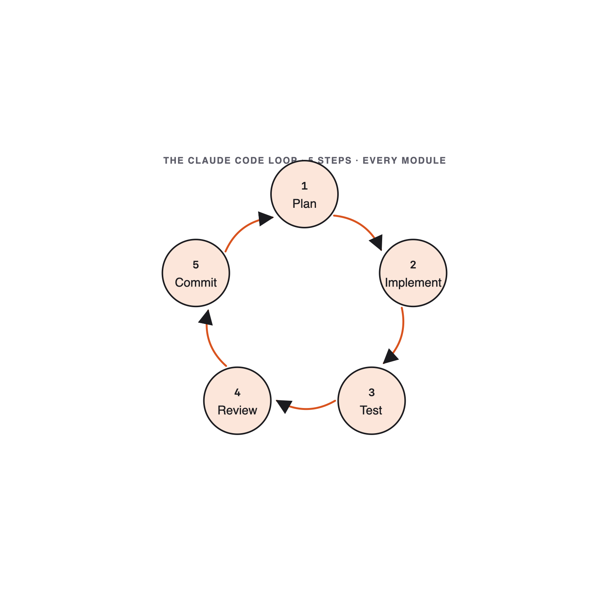

# 01. Setup & AI-First Mindset

Module 01 · 20 min

## Setup & AI-First Mindset

**You + Claude Code = a junior engineer you direct, review, and merge.**

Instructor: **Luca Berton**

### Welcome · What you'll build today

**10 small, real projects in 4 hours** — one per module, all with Claude Code.

- **Format**: short theory → live demo → you build it → quick review. Every module.
- **Proof of work**: each module drops a `module-NN/` folder into your final submission zip.
- **The through-line**: one repeatable loop you take back to your day job on Monday.

You direct. Claude implements. You review and merge. **You are always the engineer of record.**

### Your instructor — Luca Berton

- **Automation engineer & educator.** 15+ years shipping infrastructure-as-code, Ansible, and developer tooling for global enterprises.
- **Author & speaker.** Books on Ansible and DevOps; regular conference speaker; runs a YouTube channel on automation.
- **AI-paired delivery practitioner.** Uses Claude Code daily to plan, refactor, document, and review production code.
- **Today's mission**: get you shipping with Claude Code the same way — safely, repeatably, with a loop you can take home.

🔗 [lucaberton.com](https://lucaberton.com/)

### Anthropic & the Claude models (May 2026)

**Anthropic** builds Claude — frontier models with a safety-first focus. **Claude Code** is their agentic coding tool.

| Model | Best for | Trade-off |
|---|---|---|
| **Claude Opus** | Hardest reasoning: architecture, gnarly refactors, multi-file plans | Slowest · highest cost |
| **Claude Sonnet** | The daily driver: most coding, reviews, tests | Balanced speed / cost / quality |
| **Claude Haiku** | Fast, cheap: quick edits, summaries, high-volume calls | Less depth on hard problems |

**Rule of thumb**: start on **Sonnet**. Escalate to **Opus** when stuck on design. Drop to **Haiku** for bulk/trivial work. Switch live with `/model`.

### Theory · The AI coding loop (3 min)

**You stay the engineer of record. Claude proposes; you decide.**

Every module today repeats the same 5 steps:

> **Plan → Implement → Test → Review → Commit**

- **Plan** — write the prompt the way a Tech Lead writes a spec.
- **Implement** — let Claude generate; you read every line.
- **Test** — run it. If it doesn't run, you have nothing.
- **Review** — read it as if it came from a stranger's PR.
- **Commit** — atomic commits, written prose, no `Co-authored-by: Claude`.

**Skipping `Review` is the #1 way AI-generated bugs reach production.**

### The loop you'll repeat all day



**Plan → Implement → Test → Review → Commit.** Skipping **Review** is how AI bugs ship.

### Reference · Claude Code is everywhere (May 2026)

Claude Code ships on **four surfaces** with one shared context:

- **Terminal** — hands-on repo work, `claude -p` piping.
- **VS Code / JetBrains** — inline diffs, gutter actions.
- **Desktop app** — visual diff review, screenshots.
- **Web** — remote/cloud tasks, parallel work, shared sessions.

Today we work in **terminal + IDE**. Patterns transfer to the other surfaces unchanged.

### Reference · Slash commands cheat sheet

| Command | What it does |
|---|---|
| `/help` | List every available slash command |
| `/init` | Scaffold a `CLAUDE.md` for the current repo |
| `/clear` | Reset the conversation (forget context) |
| `/compact` | Compress history (keeps a summary, saves tokens) |
| `/model` | Switch model: Sonnet / Opus / Haiku |
| `/cost` | Show token spend and session cost |
| `/review` | Review the working-tree diff |
| `/agents` · `/mcp` · `/hooks` | Manage subagents · MCP servers · hooks |
| `/memory` | Open the memory editor |
| `/permissions` | Allow / deny tools per project |
| `/doctor` | Diagnose env, auth, and integrations |
| `/exit` | Leave the session (Ctrl-D works too) |

Forgot one? `/help` is one keystroke away.

### Reference · Common mistakes

- Copying Claude's reply verbatim — the rubric penalises this.
- Treating Review as optional.
- Using PowerShell on Windows — move to WSL2 (see `student-guide.md`).

### Live demo · "Read this repo" (5 min)

Watch. Don't type yet.

1. Open this repo in your IDE; run `git status` (clean) + `python3 --version` / `node --version` (green).
2. Paste the prompt verbatim:

```text
List the top-level files and tell me what kind of repository this is.
```

3. Claude reads the tree → narrates "workshop repo: slides + exercises + skills".
4. While it responds, narrate the **5-step loop** out loud.

**Success signal**: Claude names `slides/`, `exercises/`, and `skills/` without you opening them.

### Your turn · Verify + name the loop (8 min)

**Exercise**: [`exercises/part-01/README.md`](#hands-on-exercise--module-01)

**Step 1** — capture your environment:

```bash
mkdir -p module-01
{ python3 --version; node --version; git --version; } > module-01/environment.txt
```

**Step 2** — paste into Claude Code, then **rewrite the reply in your own words** into `module-01/loop-notes.md`:

```text
In one short paragraph (≤ 6 sentences), explain the loop:
Plan → Implement → Test → Review → Commit.
End with one sentence on why skipping Review is the most common failure mode.
```

**Success signal**: `module-01/` contains both files; the notes name all 5 steps in order.

### Done & next (1 min)

**Definition of done**

- [ ] `module-01/environment.txt` — three version strings.
- [ ] `module-01/loop-notes.md` — names all 5 steps, **in your own words**.

**Next** — we apply step 1 (**Plan**) by writing prompts a Tech Lead would sign off on.
**Module 2 — Prompting Like a Tech Lead.**

## Hands-on exercise — Module 01 {#hands-on-exercise--module-01}

> **Companion repository** — Work this exercise from the live files in the [Claude Code Bootcamp repository](https://github.com/lucab85/Claude-Code-Bootcamp): [`exercises/part-01/README.md`](https://github.com/lucab85/Claude-Code-Bootcamp/blob/main/exercises/part-01/README.md).
> Reference solution: [`exercises/part-01/solution/README.md`](https://github.com/lucab85/Claude-Code-Bootcamp/blob/main/exercises/part-01/solution/README.md).

## Module 1 — AI Coding Workspace

### Goal

Verify your environment and articulate the AI coding loop in your own words.

### Scenario

You're starting a 4-hour workshop. Before the first prompt, prove your toolchain works and write down — in your own words — how you'll use Claude Code today.

### Starter instructions

1. Open a terminal in a working directory you'll use for the day.
2. Create `module-01/`.
3. Confirm the bootcamp repo is cloned (you ran this in pre-work).

### Claude Code prompt to use

```text
You are onboarding a new engineer who has never used AI-paired coding.
In one short paragraph (max 6 sentences), explain the loop:
Plan → Implement → Test → Review → Commit.
Use the metaphor of directing a junior engineer.
End with one sentence about why skipping the Review step is the most common failure mode.
```

### Build the deliverables

This module has **two** files to produce. Neither is created automatically — you write both by hand.

**1. `environment.txt`** — capture the three version checks. Paste one command at a time:

```bash
mkdir -p module-01
python3 --version  > module-01/environment.txt
node --version    >> module-01/environment.txt
git --version     >> module-01/environment.txt
```

**2. `loop-notes.md`** — Claude's answer is your *raw material*, not the deliverable. Read what Claude wrote, then **rewrite the loop in your own words** and save it. Open the file in your editor and paste your reworded paragraph, or from the terminal:

```bash
cat > module-01/loop-notes.md
```

Type or paste your paragraph, then press **Enter** and **Ctrl-D** to save. Do not paste Claude's text verbatim — the goal is that *you* can explain the loop. (Reusing Claude's exact wording fails the Definition of done below.)

### Manual validation steps

Run each command and check it against the note beside it. Paste **one command at a time** — interactive zsh does not treat `#` as a comment, so don't paste the descriptions.

```bash
python3 --version
node --version
git --version
cat module-01/loop-notes.md
```

Expected:

- `python3 --version` → 3.11.x or higher
- `node --version` → v20.x.x or higher
- `git --version` → any recent Git
- `cat module-01/loop-notes.md` → non-empty; names all 5 steps in order, in your own words

If `cat` reports `No such file or directory`, you have not saved Claude's answer yet: create `module-01/loop-notes.md` and paste your one-paragraph explanation into it first.

### Expected deliverable

```text
module-01/
├── environment.txt   # output of the three --version commands
└── loop-notes.md     # your one-paragraph loop explanation
```

### Definition of done

- [ ] `environment.txt` shows valid Python 3.11+, Node 20+, Git versions.
- [ ] `loop-notes.md` names all 5 steps in order.
- [ ] Notes are in *your* words — not Claude's verbatim output.

### Stretch challenge

Write a second paragraph in `loop-notes.md` describing one situation in your day job where the loop would have caught a bug.

### Troubleshooting

| Symptom | Fix |
|---|---|
| `python3` not found | Re-run pre-work install steps (`student-guide.md`). |
| `node` not found | Install Node 20 LTS. |
| WSL2 issues | Always run inside the Ubuntu shell, never PowerShell. |
| Claude Code unresponsive | Verify you're authenticated; pair with a neighbor for module 1 only. |

## Solution — Module 01 {#solution--module-01}

## Reference solution — Module 1

> **Stop**: only open this after you have produced your own `module-01/` deliverable.

This module's deliverable is a **workspace** (not running code), so the reference solution is a worked example of what a strong submission contains. Compare your `module-01/` against the checklist below; do not copy.

### What a strong `module-01/` contains

```text
module-01/
├── environment.txt   # output of: python3 --version, node --version, git --version
└── loop-notes.md     # your one-paragraph explanation of the loop, in your own words
```

### The verification check

Confirm your toolchain, then read back your notes (paste one command at a time):

```bash
python3 --version
node --version
git --version
cat module-01/loop-notes.md
```

A strong `loop-notes.md` names all five steps in order — **Plan → Implement → Test → Review → Commit** — in your own words, and closes with why skipping **Review** is the most common failure mode. The reference paragraph looks like this (truncated):

```text
Working with Claude Code is like directing a junior engineer: you Plan the task as a
clear spec, let Claude Implement it, then Test that it runs, Review every line as if it
came from a stranger's PR, and only then Commit. Skipping Review is the #1 way
AI-generated bugs reach production.
```

### Definition of done (mirror of the exercise)

- [ ] `module-01/environment.txt` shows valid Python 3.11+, Node 20+, and Git versions.
- [ ] `module-01/loop-notes.md` names all 5 steps in order, in *your* words — not Claude's verbatim output.
- [ ] You can articulate the **plan → implement → test → review → commit** loop without notes.
