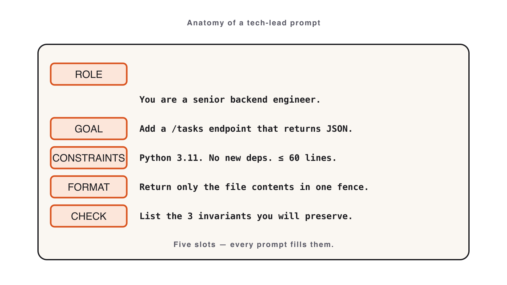

# 02. Prompting

Module 02 · 24 min

## Prompting Like a Tech Lead

**A great prompt is a spec. Write it the way a Tech Lead writes a ticket.**

### Theory · The GCOE prompt (4 min)

A production prompt has **four parts — skip one and quality drops**:

> **G**oal · **C**onstraints · **O**utput format · **E**xamples

- **Goal** — one verb-led sentence: what can the user *do* at the end?
- **Constraints** — language, deps, file layout, error handling, and what must **not** happen.
- **Output format** — files, exit codes, JSON shapes if any.
- **Examples** — one happy path + one edge case is enough to disambiguate.

**A vague prompt produces plausible code that fails review. GCOE produces code you can merge.**

### Anatomy of a GCOE prompt



**G**oal · **C**onstraints · **O**utput · **E**xamples — skip one and quality drops.

### Reference · GCOE skeleton you can paste

```text
GOAL: A user can <verb> <thing> from the command line.

CONSTRAINTS:
- Language: Python 3.11, standard library only (no third-party deps).
- Persist state to ./tasks.json.
- Exit codes: 0 success, 1 user error, 2 internal error.

OUTPUT:
- A single runnable script + a short README with usage.

EXAMPLES:
- `task add "Buy milk"` -> prints new id, exit 0.
- `task done 999` (missing id) -> prints error to stderr, exit 1.
```

Keep it tight. Every line removes one wrong guess Claude could make.

### Reference · Common mistakes

- "Build a CLI" with no constraints — looks fine, fails review.
- Allowing unintended third-party deps (the constraint exists for a reason).
- Skipping examples and exit codes — production CLIs are graded on exit codes, not stdout.

### Live demo · Vague vs. GCOE (5 min)

**Step 1 — paste the vague prompt:**

```text
Make a CLI to manage tasks.
```

**Step 2 — paste the GCOE prompt and re-run:**

```text
GOAL: A user can add, list, complete, and delete tasks from the command line.
CONSTRAINTS: Python 3.11, stdlib only; persist to ./tasks.json;
  exit codes 0 success / 1 user error / 2 internal error.
OUTPUT: one runnable script + a short usage README.
EXAMPLES: `task add "Buy milk"` -> prints id, exit 0;
  `task done 999` -> stderr error, exit 1.
```

**Success signal**: the GCOE version runs all four commands with correct exit codes; the vague one doesn't.

### Your turn · CLI Task Manager (12 min)

**Exercise**: [`exercises/part-02/README.md`](#hands-on-exercise--module-02)

Build a CLI with four commands, persisted to `tasks.json`:

```text
task add "<title>"        # -> prints new id
task list [--status STATE]
task done <id>
task delete <id>
```

**Prompt**: start from the GCOE skeleton; fill Goal/Constraints/Output/Examples for *your* task manager.

**Deliverable**: working CLI in `module-02/` + `iteration-notes.md` recording one deleted constraint and its code diff.

**Success signal**: all four commands run end-to-end; exit codes are `0` / `1` / `2`.

### Done & next (1 min)

**Definition of done**

- [ ] Four commands work; `tasks.json` round-trips state.
- [ ] Exit codes correct (`0` / `1` / `2`).
- [ ] `iteration-notes.md` documents one deleted constraint + diff.

**Next** — a good prompt is per-task. Now we make Claude follow your repo's rules *automatically*.
**Module 3 — Project Context with CLAUDE.md.**

## Hands-on exercise — Module 02 {#hands-on-exercise--module-02}

> **Companion repository** — Work this exercise from the live files in the [Claude Code Bootcamp repository](https://github.com/lucab85/Claude-Code-Bootcamp): [`exercises/part-02/README.md`](https://github.com/lucab85/Claude-Code-Bootcamp/blob/main/exercises/part-02/README.md).
> Reference solution: [`exercises/part-02/solution/README.md`](https://github.com/lucab85/Claude-Code-Bootcamp/blob/main/exercises/part-02/solution/README.md).

## Module 2 — CLI Task Manager

### Goal

Ship a CLI Task Manager (add, list, done, delete) with JSON persistence, using a Tech-Lead-grade GCOE prompt.

### Scenario

A teammate asks for a quick CLI to track personal tasks. They have not specified anything beyond "make it work". You translate that ask into a precise prompt and ship a working tool in one pass. Then you iterate one prompt edit and document the diff.

### Starter instructions

1. Pick your track:
   - **Track A — Python** (3.11, stdlib only, `argparse`).
   - **Track B — Node + TypeScript** (Node 20, `commander`, `tsx`).
2. Create `module-02/` for submission and a working folder for code.
3. Open Claude Code in the working folder.

### Claude Code prompt to use

```text
GOAL
Build a single-binary CLI Task Manager so a developer can manage TODOs from the terminal.

CONSTRAINTS
- Language: Python 3.11 (stdlib only) — OR — TypeScript on Node.js 20 with `commander` + `tsx`.
- Persistence: a single JSON file `tasks.json` in CWD.
- No background processes. No network calls.
- Exit code 0 on success, 1 on user error, 2 on internal error.
- All user-facing strings in English.

OUTPUT FORMAT
- One source file (Python) or `src/index.ts` + `package.json` (Node).
- A short README explaining install + the four commands.

EXAMPLES
- `task add "Write the spec"` → "Added task #1: Write the spec"
- `task list` → tabular: id, status, created_at, text
- `task done 1` → "Marked #1 as done"
- `task delete 99` → exit 1, "No task with id 99"
```

### Manual validation steps

**Python (track A):**

```bash
python3 task.py add "Write the spec"
python3 task.py list
python3 task.py done 1
python3 task.py delete 99
```

Expected: `add` exits 0; `list` shows the task; `done 1` exits 0; `delete 99` exits 1.

**Node (track B):**

```bash
npx tsx src/index.ts add "Write the spec"
npx tsx src/index.ts list
npx tsx src/index.ts done 1
npx tsx src/index.ts delete 99
```

Expected: `delete 99` exits 1; the other commands exit 0.

Confirm `tasks.json` round-trips state across runs.

### Expected deliverable

```text
module-02/
├── <source files for chosen track>
├── README.md
└── iteration-notes.md   # one prompt edit + the resulting diff summary
```

A reference solution covering both tracks lives at `solution/` once you've completed the lab.

### Definition of done

- [ ] All four commands return correct exit codes.
- [ ] `tasks.json` persists across runs.
- [ ] `iteration-notes.md` documents one prompt edit and what changed.
- [ ] Reference solution **not** consulted before completing.

### Stretch challenge

Add `task list --status open` and `task list --status done` filters. Document the prompt change in `iteration-notes.md`.

### Troubleshooting

| Symptom | Fix |
|---|---|
| `tasks.json` not created | Confirm CWD is writable; check Claude added file I/O. |
| Empty list after add | Round-trip bug — Claude likely forgot to flush; re-prompt with that constraint. |
| Node track: `tsx` not found | `npm i -D tsx`. |
| Python track: third-party deps appeared | Re-prompt with the "stdlib only" constraint reinforced. |

## Solution — Module 02 {#solution--module-02}

## Reference solution — Module 2

> **Stop**: only open this after you have produced `module-02/cli.py` (or `cli.js`) and `PROMPT.md`.

Two parallel tracks ship under this directory. Pick the one matching your stack and diff your work against it:

| Track | Path | Run |
|---|---|---|
| Python (primary) | `python/` | `python3 python/cli.py add "first task"` |
| Node.js (secondary) | `node/` | `node node/cli.js add "first task"` |

Both implement the same CLI Task Manager spec from `../README.md`. They are not byte-identical: differences highlight where Best-of-N (Module 4) would choose between them.

### What to compare

1. **`PROMPT.md` shape** — does yours follow GCOE (Goal · Constraints · Output · Examples)?
2. **Command surface** — `add`, `list`, `done`, `delete`, `--help`.
3. **Persistence** — both use a single JSON file (`tasks.json`) in the project root.
4. **Error paths** — empty input, missing ID, broken JSON.

### Definition of done

See `../README.md` — the rubric is unchanged.
