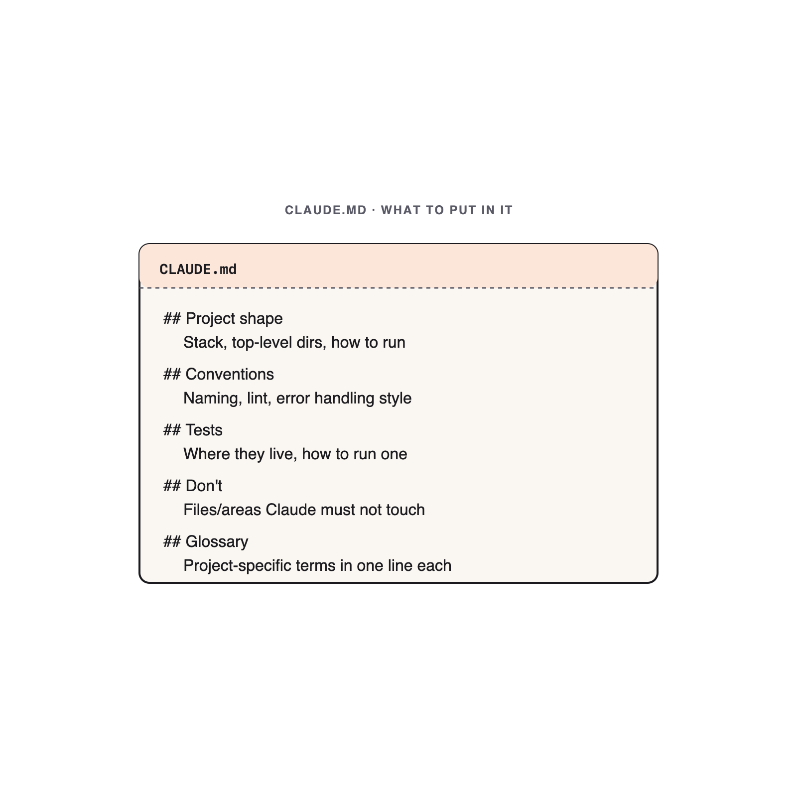

# 03. CLAUDE.md Brain Files

Module 03 · 22 min

## Project Context with CLAUDE.md

**Stop re-explaining your stack. Write it once; Claude reads it every prompt.**

### Theory · CLAUDE.md is a behavior file (4 min)

`CLAUDE.md` lives at the repo root. Claude reads it **automatically on every prompt**.

> It is a *behavior* file, not documentation. Every line must change Claude's output.

Five sections earn their place:

- **Stack** — languages, versions, frameworks.
- **Conventions** — naming, layout, lint rules.
- **Commands** — exact build / test / run / lint.
- **Do-not** — hard lessons, the traps.
- **Glossary** — domain terms only your team uses.

**Trim test**: delete a section; if Claude behaves the same, it was bloat. Aim **under 80 lines**.

### CLAUDE.md at a glance



Five sections — **Stack · Conventions · Commands · Do-not · Glossary** — under 80 lines.

### Reference · A lean CLAUDE.md (≤ 80 lines)

```text
# CLAUDE.md

## Stack
- Python 3.11, standard library only.

## Conventions
- snake_case files; one command per module under cli/.
- Lint: ruff. Format: black.

## Commands
- Test:  pytest -q
- Run:   python -m taskcli
- Lint:  ruff check .

## Do-not
- Do NOT add third-party deps without asking.
- Do NOT swallow exceptions; surface exit codes.
```

Template: `skills/claude-md-template/SKILL.md`.

### Reference · A complete CLAUDE.md (all 5 sections)

```text
# CLAUDE.md — Notes API

## Stack
- Python 3.11 · FastAPI · Pydantic v2 · SQLite (stdlib sqlite3).
- Tests: pytest + httpx. Lint: ruff. Format: black.

## Conventions
- snake_case modules; routes in app/routers/, models in app/models.py.
- One Pydantic model per resource; never return ORM rows directly.
- HTTP status: 201 create · 200 read/update · 204 delete · 404 · 422.

## Commands
- Test:  pytest -q
- Run:   uvicorn app.main:app --reload
- Lint:  ruff check . && black --check .

## Do-not
- Do NOT add deps without asking — stdlib + the four above only.
- Do NOT swallow exceptions; raise HTTPException with a clear detail.
- Do NOT write to the DB outside a repository function.

## Glossary
- "note": {id, title, body, created_at} — body may be empty, title may not.
- "winner": the Best-of-N candidate chosen in Module 4.
```

Every line changes Claude's output. Still under 80 lines.

### Reference · Common mistakes

- Writing an `ABOUT.md` (documentation) instead of a behavior file.
- 200 lines of bloat instead of a lean 80.
- Skipping **Do-not** — and not committing the file (if it's not in git, it isn't real).

### Live demo · Before vs. after CLAUDE.md (5 min)

**The prompt — run it twice, unchanged (before, then after):**

```text
Add an `--export csv` flag to the task CLI that writes all tasks
to a file. Match the project's existing conventions.
```

1. Run it on the Module 2 repo with **no** `CLAUDE.md` → off-convention output.
2. Drop in a 12-line `CLAUDE.md`; in a **fresh chat**, paste the **same** prompt → now follows conventions.
3. Trim test: delete one section, re-prompt, observe the drift.

**Success signal**: with `CLAUDE.md` present, Claude matches your naming/layout without being told.

### Your turn · Author your CLAUDE.md (10 min)

**Exercise**: [`exercises/part-03/README.md`](#hands-on-exercise--module-03)

Write a `CLAUDE.md` for your Module 2 repo (or a personal repo):

- All five sections: **Stack · Conventions · Commands · Do-not · Glossary**.
- **Under 80 lines.** Run the **trim test** at least once.

**Prompt**: *"Read this repo and draft a CLAUDE.md with Stack, Conventions, Commands, Do-not, Glossary. Keep it under 80 lines; every line must change your behavior."*

**Success signal**: on the next prompt, Claude obeys one convention you wrote — capture a proof screenshot.

### Done & next (1 min)

**Definition of done**

- [ ] `CLAUDE.md` < 80 lines, all five sections, committed to git.
- [ ] Trim test performed at least once.
- [ ] Proof screenshot of Claude obeying one convention.

**Next** — with rules in place, we generate *several* solutions and pick the best.
**Module 4 — Build Faster with Best-of-N.**

## Hands-on exercise — Module 03 {#hands-on-exercise--module-03}

> **Companion repository** — Work this exercise from the live files in the [Claude Code Bootcamp repository](https://github.com/lucab85/Claude-Code-Bootcamp): [`exercises/part-03/README.md`](https://github.com/lucab85/Claude-Code-Bootcamp/blob/main/exercises/part-03/README.md).
> Reference solution: [`exercises/part-03/solution/README.md`](https://github.com/lucab85/Claude-Code-Bootcamp/blob/main/exercises/part-03/solution/README.md).

## Module 3 — Project Context with CLAUDE.md

### Goal

Author a `CLAUDE.md` for a real repo and prove Claude follows it on the next prompt.

### Scenario

You inherit a repo. Every time you prompt Claude, you re-explain stack, conventions, and "do nots". That waste is what `CLAUDE.md` exists to remove. Today you commit one — and earn it back.

### Starter instructions

1. Pick a repo: your module-2 work, or any personal repo you trust to commit to.
2. `cd` into it.
3. Create `module-03/` in your submission directory.
4. Open `skills/claude-md-template/SKILL.md` for the template.

### Claude Code prompt to use

```text
You are drafting CLAUDE.md for the repo at the current working directory.
Read the repo first. Then propose a CLAUDE.md with these sections:

# Stack       — languages, package managers, runtime versions
# Conventions — naming, file layout, lint/format rules
# Commands    — exact commands for build, test, run, lint
# Do-not      — things you must never do (e.g., add deps without asking)
# Glossary    — domain terms only this team uses

Each line must change your behavior on a future prompt. If a line is just
documentation, omit it. Keep the whole file under 80 lines.
```

### Manual validation steps

1. `wc -l CLAUDE.md` → ≤ 80.
2. Confirm all five H1 sections present: `Stack`, `Conventions`, `Commands`, `Do-not`, `Glossary`.
3. Open a fresh Claude Code chat. Ask one prompt that depends on a `Conventions` line (e.g., naming).
4. Verify Claude obeys.
5. Screenshot the obedient response → `module-03/proof.png`.

### Expected deliverable

```text
module-03/
├── CLAUDE.md      # copy of the file you committed to the underlying repo
└── proof.png      # screenshot of Claude obeying one convention
```

### Definition of done

- [ ] File is committed to the underlying repo (not just sitting in the submission folder).
- [ ] All five H1 sections present.
- [ ] ≤ 80 lines total.
- [ ] `proof.png` shows Claude obeying.
- [ ] You can name one line you deleted in the trim test, and why.

### Stretch challenge

Apply the trim test rigorously: delete each section in turn, re-prompt, observe drift. Document which section caused the largest behavior regression in `module-03/trim-notes.md`.

### Troubleshooting

| Symptom | Fix |
|---|---|
| File over 80 lines | Trim ruthlessly — every line must change behavior. |
| Claude ignores the file | Confirm it's at repo root and you're in a fresh chat. |
| Proof screenshot is unconvincing | Re-pick a convention that produces a visible diff in output. |

## Solution — Module 03 {#solution--module-03}

## Reference solution — Module 3

> **Stop**: only open this after you have authored your own `module-03/CLAUDE.md`.

This module produces a **document**, not running code, so the reference solution is a worked `CLAUDE.md` you can diff against.

```text
module-03/
├── CLAUDE.md          # your project brain file
└── before-after.md    # 2-paragraph note: what changed in Claude's behaviour after CLAUDE.md was added
```

### Reference `CLAUDE.md` skeleton

Use this skeleton as a starting comparison. Your version should be **shorter and more specific** to your repo.

```markdown
# Project brain file

## What this repo is
One paragraph. What the codebase does. Who uses it.

## House rules
- Tests live in `tests/`. Run them with `pytest -q`.
- Conventional Commits; no `Co-authored-by: Claude`.
- Never commit to `main` directly.

## Architecture pointers
- Entry point: `src/main.py`.
- Public surface: `src/api/`.
- Datastore: SQLite at `data/app.db`; schema in `src/db/schema.sql`.

## What to do, what NOT to do
- DO ask before adding a dependency.
- DO not introduce a new framework. Use the existing stack.
- DO produce a plan before any change > 50 lines.

## Skills to invoke
- `code-review` before any commit.
- `release-readiness` before any tag.
```

### Definition of done

- [ ] All five `## ` sections present.
- [ ] Specific to your repo (no generic placeholders).
- [ ] `before-after.md` names one concrete behavioural change you observed.
