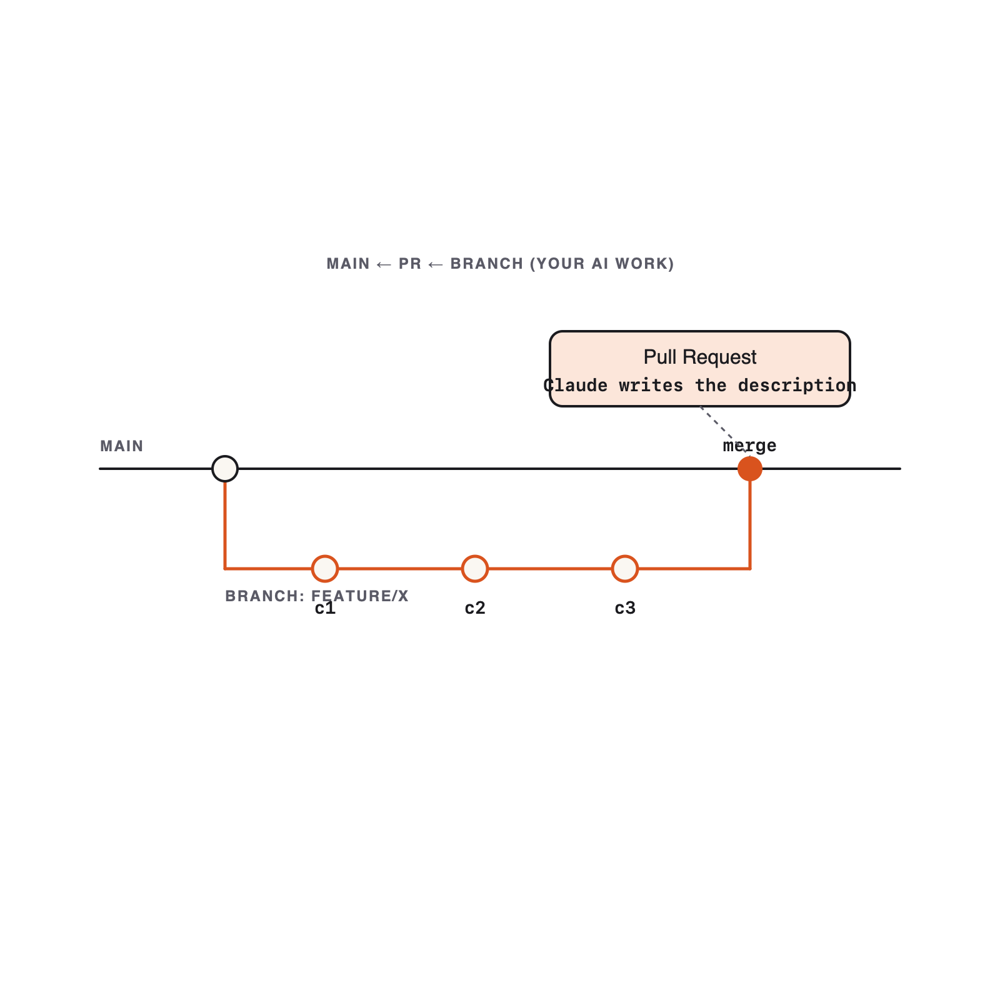

# 06. Git Workflows

Module 06 · 22 min

## Git Workflows for Safe AI Dev

**Never let Claude push to main. Branch, commit atomically, PR — you stay the gate.**

### Theory · Safe git for AI code (4 min)

- **Branch first**, always: `<type>/<scope>-<summary>` → `feat/notes-api-search`.
- **Atomic commits** — one logical change each. Claude can split a dirty tree if you ask.
- **Conventional Commits**: `feat:` · `fix:` · `chore:` · `docs:` · `test:`.
- **PR description shape**: What changed · Why · How to test · Risk · Rollback.

> Claude writes the commit messages and PR — but **from the actual diff**, never from your prompt.

Full reference: `skills/git-workflow/SKILL.md`.

### Branch → atomic commits → PR



Branch first · **atomic Conventional commits** · PR explains What · Why · Test · Risk · Rollback.

### Reference · Bonus · @claude GitHub Action

`anthropics/claude-code-action` turns Claude into a **teammate in your repo**:

- Mention `@claude` in an issue or PR comment → it proposes a fix.
- Automated PR review on every push.
- Issue-to-PR flow: describe the bug, get a draft PR.

```yaml
# .github/workflows/claude.yml (sketch)
uses: anthropics/claude-code-action@v1
with:
  anthropic_api_key: ${{ secrets.ANTHROPIC_API_KEY }}
```

Stretch goal in the exercise — wire it on a throwaway repo.

### Reference · Common mistakes

- One giant commit called `feat: stuff` — re-run the splitter.
- PR that says *what* but not *why* — reviewers reject it.
- Writing the PR from the prompt instead of the diff.
- Pushing to main (always branch first).

### Live demo · Split commits, write the PR (5 min)

1. On the Module 5 tree (dirty): `git switch -c feat/notes-api-tests-and-fixes`. Then paste:

```text
Group these staged changes into atomic commits using Conventional Commit
subjects. Show the plan (files per commit + message) before committing.
```

2. Apply and commit. Then paste:

```text
Write a PR description from the branch diff: What, Why, How to test, Risk, Rollback.
```

3. Review, edit, open a draft PR (or simulate).

**Success signal**: ≥ 3 atomic commits with Conventional subjects; PR explains *why*, not just *what*.

### Your turn · Branch → commits → PR (10 min)

**Exercise**: [`exercises/part-06/README.md`](#hands-on-exercise--module-06)

Take your Module 5 work onto a feature branch and ship a clean history:

- Create a feature branch; ask Claude to split into **≥ 3 atomic commits**.
- Generate a PR description from the **diff** (What · Why · How to test · Risk · Rollback).

**Deliverables**: `branch.txt` (name + `git log --oneline`) · `commits.md` · `pr.md`.

**Success signal**: a mergeable PR with sensible Conventional-Commit messages.

### Done & next (1 min)

**Definition of done**

- [ ] Feature branch holds all Module 5 work.
- [ ] ≥ 3 atomic commits with Conventional subjects.
- [ ] `pr.md` has all sections: Summary · Why · What changed · How to test · Risk · Rollback.

**Next** — code is safe in git. Now we feed Claude a *picture* and build a UI.
**Module 7 — Multimodal: Screenshot to UI.**

## Hands-on exercise — Module 06 {#hands-on-exercise--module-06}

> **Companion repository** — Work this exercise from the live files in the [Claude Code Bootcamp repository](https://github.com/lucab85/Claude-Code-Bootcamp): [`exercises/part-06/README.md`](https://github.com/lucab85/Claude-Code-Bootcamp/blob/main/exercises/part-06/README.md).
> Reference solution: [`exercises/part-06/solution/README.md`](https://github.com/lucab85/Claude-Code-Bootcamp/blob/main/exercises/part-06/solution/README.md).

## Module 6 — Git Workflows for Safe AI Dev

### Goal

Take your module-5 work, branch it, split it into atomic commits whose messages Claude wrote, and ship a real PR description.

### Scenario

Your working tree is dirty with everything from the morning. A senior engineer would never push that as one commit on `main`. Today you do it correctly — and let Claude do the prose work.

### Starter instructions

1. `cd` into your module-5 repo.
2. Confirm `git status` shows the dirty tree.
3. Create `module-06/` for submission artefacts.

### Claude Code prompt to use

```text
COMMIT SPLITTER
Here is the working-tree diff (output of `git diff --staged`).
Propose 3–6 atomic commits. For each: a Conventional Commit subject line
(<= 72 chars) and a body explaining why (not what — the diff shows what).
Then list which paths/hunks belong to which commit so I can split.
```

```text
PR DESCRIPTION
Generate a pull request description from the branch diff below.
Sections, in order:
- Summary (2 sentences)
- Why
- What changed (bullets, grouped by area)
- How to test (exact commands)
- Risk
- Rollback
End with a "Reviewer checklist" of 3–5 yes/no items.
Keep the whole thing under 40 lines.
```

### Manual validation steps

```bash
git switch -c feat/<your-scope>
git add -A
git diff --staged | pbcopy           # macOS — paste into Claude
# Apply Claude's commit groupings via `git reset` + selective `git add` + `git commit`
git log --oneline
git diff main..HEAD | pbcopy          # paste into Claude for the PR description
```

### Expected deliverable

```text
module-06/
├── branch.txt    # branch name + final `git log --oneline` output
├── commits.md    # commit messages Claude proposed and which you accepted/edited
└── pr.md         # final PR description
```

### Definition of done

- [ ] Feature branch named `<type>/<scope>-<summary>`.
- [ ] At least 3 atomic commits with Conventional Commit subjects.
- [ ] `pr.md` has all six required sections + reviewer checklist.
- [ ] Real PR opened or simulated (screenshot acceptable).

### Stretch challenge

Use the `skills/git-workflow/SKILL.md` skill against the same diff and compare its output to the prompt-only output in `module-06/skill-vs-prompt.md`.

**Bonus — `@claude` GitHub Action**: Add the `anthropics/claude-code-action` workflow to your repo (`.github/workflows/claude.yml`) so opening this PR triggers an automated `@claude` review comment. Capture the resulting comment as `module-06/claude-action-review.md`. See `slides/part-06-git-workflows.md` for the wiring snippet.

### Troubleshooting

| Symptom | Fix |
|---|---|
| One giant commit | Re-run the splitter; apply with `git reset` and selective `git add -p`. |
| PR text says *what* but not *why* | Re-prompt with the diff *and* an explicit "explain why" instruction. |
| Pushed to `main` | Reset, branch, force-push to your feature branch only. |

## Solution — Module 06 {#solution--module-06}

## Reference solution — Module 6

> **Stop**: only open this after you have split your dirty tree into atomic commits and drafted `pr.md`.

This module produces a **branch history + PR description**, not running code. The reference solution is a worked example of what a strong submission contains.

```text
module-06/
├── branch.txt                    # branch name + final `git log --oneline` output
├── commits.md                    # commits Claude proposed and which you kept/edited
├── pr.md                         # final PR description (six sections + reviewer checklist)
└── claude-action-review.md       # bonus — comment from the @claude GitHub Action
```

### Reference branch shape

```text
feat/task-validation-cleanup
* a1b2c3d  feat(cli): reject empty task titles with exit code 2
* b2c3d4e  refactor(persistence): extract tasks.json read/write into store.py
* c3d4e5f  test(cli): cover delete with missing id
* d4e5f6g  docs(readme): document --help output
```

Four atomic commits. Each Conventional Commit; subject ≤ 72 chars; body explains **why** (the diff shows **what**).

### Reference `pr.md` shape

Six H2 sections in this order: **Summary · Why · What changed · How to test · Risk · Rollback**. Reviewer checklist of 3–5 yes/no items. Whole document ≤ 40 lines.

### `@claude` GitHub Action (bonus)

Wiring snippet (full version in `slides/part-06-git-workflows.md`):

```yaml
# .github/workflows/claude.yml
on:
  issue_comment:
    types: [created]
  pull_request_review_comment:
    types: [created]
jobs:
  claude:
    if: contains(github.event.comment.body, '@claude')
    runs-on: ubuntu-latest
    permissions:
      contents: read
      pull-requests: write
    steps:
      - uses: anthropics/claude-code-action@v1
        with:
          anthropic_api_key: ${{ secrets.ANTHROPIC_API_KEY }}
```

`claude-action-review.md` should be the Markdown comment the Action posted on your PR.

### Definition of done

See `../README.md`. Three or more atomic commits + PR with six sections + reviewer checklist.
