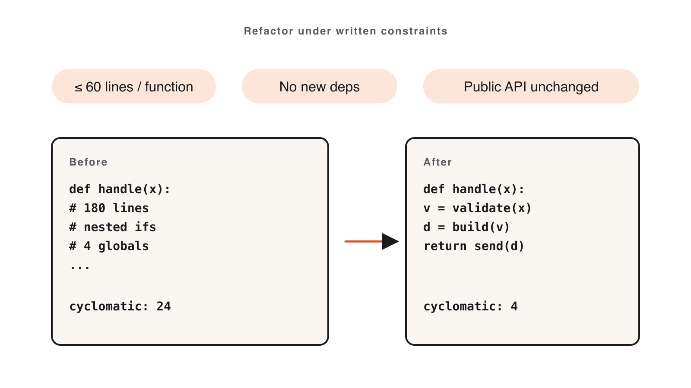

# 08. Refactor & Docs

Module 08 · 24 min

## Refactoring & Documentation at Scale

**Refactor under written constraints. Document from the diff — never from the prompt.**

### Theory · Constrained refactor + two-pass docs (4 min)

> **Tell Claude what may NOT change**: public API, file count, runtime behavior.

- **Two-pass workflow** — keep them separate:
  - **Pass 1**: refactor for readability only.
  - **Pass 2**: generate docs **from the diff**.
- **`HANDOFF.md`** — one-pager for the next engineer: what changed · why · risk · watch-outs.
- **`ARCHITECTURE.md`** — component shape, data flow, **one** diagram (ASCII is fine), known limits.

**Combine the two passes and the docs describe your prompt, not the code.**

### Refactor inside the guardrails



**constraints.md** fixes what must NOT change — write it *before* you touch the code.

### Reference · constraints.md (write it first)

```text
# Refactor constraints

## May change
- Internal function structure, names, early returns.

## Must NOT change
- Public function signatures / CLI flags.
- File count (no new modules).
- Observable runtime behavior — tests must stay green.

## Style
- Replace nested conditionals with early returns.
- No comments unless they explain *why*.
```

### Reference · Common mistakes

- Skipping `constraints.md` → Claude rewrites everything → lab spent reading.
- Combining refactor + docs in one prompt → docs describe the prompt.
- Vetoing every unrequested change (some are fine — read the diff).
- 200-line `ARCHITECTURE.md` (trim aggressively).

### Live demo · Bad vs. constrained refactor (5 min)

1. Open `exercises/part-08/before/` (messy). Show the **unconstrained** refactor → bloated diff.
2. Reset. Paste the **constrained** prompt:

```text
Refactor for readability only, obeying constraints.md exactly. Do not change
public signatures, file count, or behavior. Tests must stay green. Show the diff.
```

3. Run tests → still green.
4. Pass 2: generate `HANDOFF.md` from the diff; read it aloud.

**Success signal**: the constrained diff respects every line of `constraints.md` and tests stay green.

### Your turn · Refactor + handoff docs (12 min)

**Exercise**: [`exercises/part-08/README.md`](#hands-on-exercise--module-08)

1. Copy the messy module to `module-08/after/`.
2. Write `constraints.md` **before** touching code.
3. Refactor for readability only; re-run the existing tests (must stay green).
4. Pass 2 — generate `HANDOFF.md` and `ARCHITECTURE.md` from the diff.

**Success signal**: tests green · diff respects every constraint · both docs within length limits.

### Done & next (1 min)

**Definition of done**

- [ ] Tests still green; diff respects every constraint.
- [ ] `HANDOFF.md` ≤ 40 lines, all four sections.
- [ ] `ARCHITECTURE.md` ≤ 80 lines, has a diagram + component paragraphs.

**Next** — we graduate from prompts to *agentic engineering*: Skills, Hooks, MCP, multi-agent.
**Module 9 — Skills, Hooks, MCP & Multi-Agent Workflows.**

## Hands-on exercise — Module 08 {#hands-on-exercise--module-08}

> **Companion repository** — Work this exercise from the live files in the [Claude Code Bootcamp repository](https://github.com/lucab85/Claude-Code-Bootcamp): [`exercises/part-08/README.md`](https://github.com/lucab85/Claude-Code-Bootcamp/blob/main/exercises/part-08/README.md).
> Reference solution: [`exercises/part-08/solution/README.md`](https://github.com/lucab85/Claude-Code-Bootcamp/blob/main/exercises/part-08/solution/README.md).

## Module 8 — Refactoring & Documentation at Scale

### Goal

Refactor a deliberately messy Python module under hard written constraints. Ship `HANDOFF.md` and `ARCHITECTURE.md` from the diff.

### Scenario

You've inherited a 200-line Python module nobody wants to touch. You have 24 minutes. You will write the constraints **first**, run a constrained refactor, and produce two short docs from the diff.

### Starter instructions

1. Read `solution/before/`. The mess is intentional — note what bothers you.
2. Copy `solution/before/` to `module-08/after/`.
3. Create `module-08/constraints.md` and write your constraint list **before** prompting Claude.

### Claude Code prompt to use

```text
CONSTRAINED REFACTOR
You will refactor the module below for readability only.

HARD CONSTRAINTS
- No new files. No new dependencies.
- Public function signatures unchanged. Module-level imports unchanged.
- Behavior on all existing tests must be byte-identical.
- Replace nested conditionals with early returns where it shortens code.
- Rename local variables only when the new name is materially clearer.
- No comments unless they explain a non-obvious *why*.

Output: a unified diff. No prose around it.
```

```text
HANDOFF.md
Generate a one-page HANDOFF.md from the diff below. Sections:
- What changed (3 bullets max)
- Why
- Risk + how to roll back
- Watch-outs for the next engineer (specific, not generic)
Keep under 40 lines.
```

```text
ARCHITECTURE.md
Read the refactored module and produce ARCHITECTURE.md.
- One ASCII diagram (boxes and arrows) of components and data flow.
- A short paragraph per component (purpose, inputs, outputs).
- A "Known limitations" list with at most 5 items.
Keep under 80 lines.
```

### Manual validation steps

```bash
cd module-08/after
python -m pytest    # all tests still green
wc -l ../HANDOFF.md         # ≤ 40
wc -l ../ARCHITECTURE.md    # ≤ 80
```

Diff `module-08/after/` against `solution/before/` and confirm every change is justified by a line in `constraints.md`.

### Expected deliverable

```text
module-08/
├── after/             # refactored source
├── HANDOFF.md
├── ARCHITECTURE.md
└── constraints.md
```

### Definition of done

- [ ] Existing tests still pass on `after/`.
- [ ] `constraints.md` was written before the refactor (commit timestamp confirms).
- [ ] `HANDOFF.md` ≤ 40 lines, all four sections present.
- [ ] `ARCHITECTURE.md` ≤ 80 lines, has a diagram + per-component paragraphs + ≤ 5 limitations.

### Stretch challenge

Run the **unconstrained** refactor first. Save its diff. Compare line counts and "things changed unnecessarily" between the two diffs in `module-08/comparison.md`.

### Troubleshooting

| Symptom | Fix |
|---|---|
| Claude rewrites public signatures | Tighten the constraint list; re-prompt. |
| Tests now fail | Reset and re-run with the byte-identical-behavior constraint reinforced. |
| Docs describe the prompt, not the diff | Always paste the **diff** as input, not the prompt. |
| `ARCHITECTURE.md` is 200 lines | Hard cap at 80; trim limitations + paragraphs. |

## Solution — Module 08 {#solution--module-08}

## Module 8 — Reference Material

The `before/` folder contains a deliberately messy `pricing.py` and a passing test suite. Students copy it to `module-08/after/` and refactor under hard constraints. The `after/` folder here is a **reference refactor** (a real constrained-refactor run) — same tests, same behaviour, readable code.

### Run the tests

```bash
cd before/                 # or: cd after/
pip install pytest         # broken pip? use: uv run --with pytest pytest -q
pytest -q
```

All tests must remain green after the refactor — that's the contract. Both `before/` and `after/` pass the identical suite (8 tests), which is the whole point: a readability refactor must not change behaviour.

### Reference HANDOFF and ARCHITECTURE

A reference `HANDOFF.md` and `ARCHITECTURE.md` live below; instructors compare student output against them but accept any version that satisfies the deliverable checklist in the exercise README.
