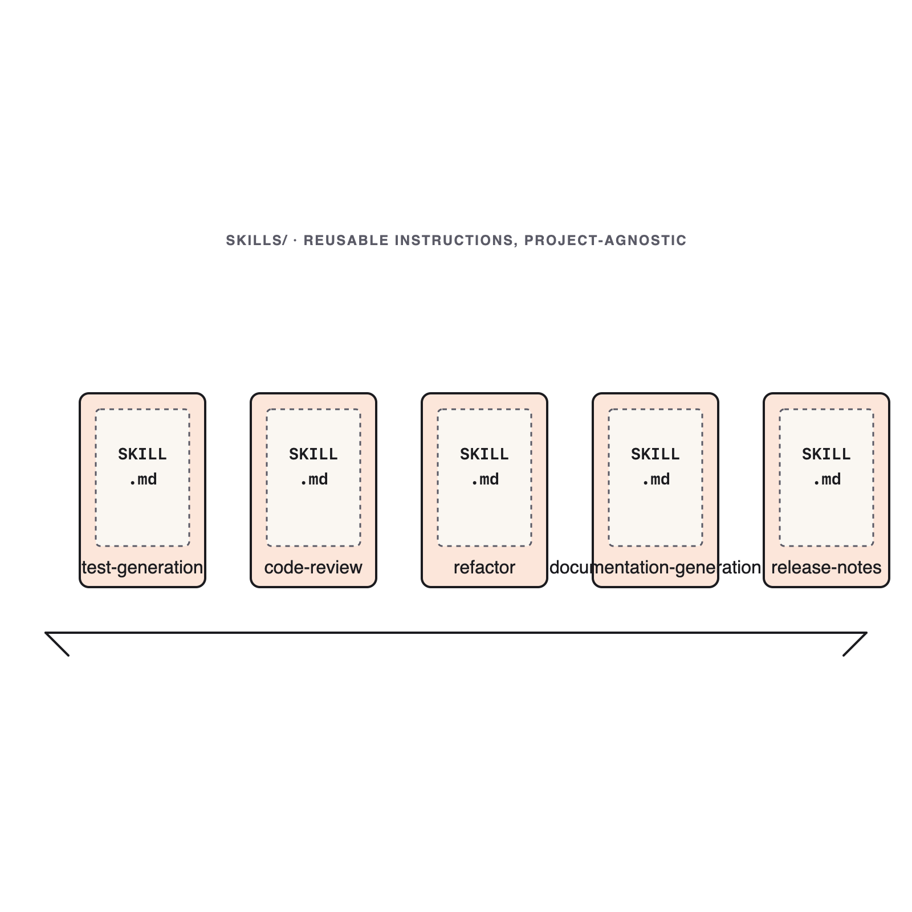

# 09. Skills & Workflows

Module 09 · 22 min

## Skills, Hooks, MCP & Multi-Agent

**Stop re-typing workflows. Package them. This is agentic engineering.**

### Theory · Four pillars of agentic engineering (4 min)

1. **Skills** — packaged workflows at `skills/<name>/SKILL.md`, invoked with `/<name>`. Your carry-out from today.
2. **Hooks** — shell commands that fire before/after Claude actions (format, lint, deny dangerous commands).
3. **MCP** — open connectors to issue trackers, docs, chat, internal tools, read as first-class context.
4. **Multi-agent** — a lead agent fans work out to workers in separate worktrees.

> Skills are the unit you'll reuse most. The rest make Claude a teammate, not a chatbot.

### The four power-ups



**Skills · Hooks · MCP · Multi-agent** — Skills are the one you'll reuse most.

### Reference · Hooks & MCP

**Hooks** — `.claude/hooks.json`:

- `post-edit` → `npx prettier --write` (auto-format).
- `pre-bash` → deny `rm -rf` (guardrail).
- `pre-commit` → run tests (no broken commits).

**MCP (Model Context Protocol)** — connect, don't paste:

- Jira / Linear / GitHub · Drive / Notion · Slack.
- **Least privilege**: read scope unless you truly need write.

### Reference · Multi-agent & common mistakes

**Multi-agent fan-out** — lead splits a feature across workers (backend / frontend / tests) in separate worktrees. **Don't** use it for tasks < 30 min, shared mutable state, or non-independent sub-tasks.

**Common mistakes**

- Vague skill body ("do a good job").
- Project-specific paths/versions in a skill (won't carry over).
- Skipping the **Worked example** (reviewers can't tell if it works).
- Fanning out 4 agents on a 10-minute task.

### Live demo · Author a Skill in 4 minutes (5 min)

1. Open `skills/code-review/SKILL.md`; read its H2 headers aloud.
2. Paste the drafting prompt:

```text
Draft a SKILL.md named "score-candidates" using the same H2 sections as
code-review/SKILL.md. Purpose: score 3 diffs on Correctness, Simplicity, Fit.
```

3. Invoke it: `/score-candidates` on three diffs.
4. Observe Claude produce output matching the skill's **Outputs** section.

**Success signal**: the new skill runs and its output matches its own spec — no extra prompting.

### Live demo · Connect GitHub over MCP (4 min)

**"Connect, don't paste."** Let Claude read GitHub directly instead of copying issue text into chat.

1. Add the connector with a **fine-grained, read-scoped** token:

```bash
claude mcp add --transport http github https://api.githubcopilot.com/mcp/ \
  --header "Authorization: Bearer $GITHUB_PAT"
```

2. Verify + authenticate: run `/mcp` (status should read **connected**).
3. Ask a question that needs the live repo — paste:

```text
Show me all open PRs assigned to me, then summarize what PR #456 changes.
```

**Success signal**: real PR data Claude could only get by reading the connector — zero copy-paste.

### Your turn · Author a reusable Skill (10 min)

**Exercise**: [`exercises/part-09/README.md`](#hands-on-exercise--module-09)

Write one **project-agnostic** skill for a workflow you'll repeat (e.g. `commit-and-pr`, `screenshot-diff`, `regression-postmortem`):

- Valid frontmatter (`name`, `description`); all **6 H2 sections** in order; body ≤ 80 lines.
- **No** project-specific paths, filenames, or versions.

**Deliverables**: `module-09/skill/SKILL.md` · `module-09/invocation.md` (one real invocation + output).

**Stretch**: add a `hooks.json`, sketch an `mcp-brief.md`, or fan a task out to two sub-agents.

**Success signal**: one real invocation whose output matches the skill's **Outputs** section.

### Done & next (1 min)

**Definition of done**

- [ ] Valid frontmatter; all 6 H2 sections in order; body ≤ 80 lines.
- [ ] No project-specific paths/versions in the body.
- [ ] One real invocation with output matching the **Outputs** spec.

**Next** — we decide if any of today's projects is actually ready to ship.
**Module 10 — Production Readiness.**

## Hands-on exercise — Module 09 {#hands-on-exercise--module-09}

> **Companion repository** — Work this exercise from the live files in the [Claude Code Bootcamp repository](https://github.com/lucab85/Claude-Code-Bootcamp): [`exercises/part-09/README.md`](https://github.com/lucab85/Claude-Code-Bootcamp/blob/main/exercises/part-09/README.md).
> Reference solution: [`exercises/part-09/solution/README.md`](https://github.com/lucab85/Claude-Code-Bootcamp/blob/main/exercises/part-09/solution/README.md).

## Module 9 — Skills, Hooks, MCP & Multi-Agent

### Goal

Author a project-agnostic `SKILL.md` that follows the contract, register **one hook** in a local `.claude/hooks.json`, and stage an **MCP** context brief for a connector (Jira / Slack / GitHub). Optionally, fan out a **multi-agent** run for the same task and compare the outputs.

### Scenario

You've used three or four bundled skills today. Now you author the one *you* will reach for first on Monday, surround it with a deterministic hook, and prove you can scope an MCP-mediated action without slurping the whole workspace. Multi-agent fan-out is the stretch.

### Starter instructions

1. Read `skills/code-review/SKILL.md` end to end. It's the worked example.
2. Read the contract: `specs/001-bootcamp-course-materials/contracts/skill.contract.md`.
3. Pick a workflow you actually want to repeat (suggestions in the slide deck).
4. Create `module-09/skill/SKILL.md`.

### Claude Code prompt to use

```text
DRAFT THE SKILL
I want a Claude Skill called `<your-name>` that <one-sentence purpose>.
Following the contract at specs/001-bootcamp-course-materials/contracts/skill.contract.md,
draft the SKILL.md. Body must be project-agnostic — no references to specific
filenames or framework versions. Worked example must be runnable as-is.
```

```text
INVOKE THE SKILL
Use the `<your-name>` skill at module-09/skill/SKILL.md.
Inputs: <attach or paste the input>.
Produce the output exactly as the skill's "Outputs" section specifies.
```

```text
REGISTER A HOOK
Create module-09/hooks.json with a single hook entry. Use one of:
- pre-bash: refuse `rm -rf` outside a worktree
- post-edit: run `npm test` after any file in src/ changes
- pre-commit: run the `code-review` skill on the staged diff
Return the JSON only.
```

```text
PREPARE AN MCP CONTEXT BRIEF
Following skills/mcp-context-brief/SKILL.md, draft module-09/mcp-brief.md
for ONE connector (Jira / Slack / GitHub / Drive). State the task,
the allowed actions, the forbidden actions, and the stop conditions.
Keep it under 400 words.
```

### Manual validation steps

1. `head -10 module-09/skill/SKILL.md` shows valid YAML frontmatter with `name` and `description`.
2. `grep -E '^## ' module-09/skill/SKILL.md` lists exactly: Purpose, When to use, Body, Inputs, Outputs, Worked example.
3. `grep -ciE 'this repo|bootcamp|module-0[0-9]|FastAPI|Hono'` returns 0 — no project-specific tokens.
4. The worked example runs as written.

### Expected deliverable

```text
module-09/
├── skill/
│   └── SKILL.md
├── hooks.json          # one entry: pre-bash / post-edit / pre-commit
├── mcp-brief.md        # context brief for one MCP connector
└── invocation.md       # one real prompt + Claude's output
```

### Definition of done

- [ ] Frontmatter valid: `name`, `description`.
- [ ] All 6 H2 sections present in order: Purpose · When to use · Body · Inputs · Outputs · Worked example.
- [ ] No repo-specific or workshop-specific paths/filenames/versions in the body.
- [ ] One real invocation captured in `invocation.md`.
- [ ] `hooks.json` registers at least one hook (pre-bash / post-edit / pre-commit) with a non-trivial command.
- [ ] `mcp-brief.md` follows the `mcp-context-brief` skill template; declares allowed actions, forbidden actions, and stop conditions.

### Stretch challenge

Run the same task with a **multi-agent fan-out**: spawn a "lead" plus two "worker" agents (or two `git worktree`-isolated agents) and compare diffs. Capture the comparison as `module-09/multi-agent-compare.md`. Note explicitly when fan-out is **worse** than a single agent — that's the real learning.

### Troubleshooting

| Symptom | Fix |
|---|---|
| Skill body says "do a good job" | Make every instruction operational — name the inputs, the steps, the outputs. |
| Skill mentions `tasks.json` or `notes.db` | Generalise. Skills must carry over. |
| Worked example doesn't run | Replace with one from a real input you used today. |

## Solution — Module 09 {#solution--module-09}

## Reference solution — Module 9

> **Stop**: only open this after you have authored your own `SKILL.md`, `hooks.json`, and `mcp-brief.md`.

This module's deliverable is a **bundle of four artefacts**:

```text
module-09/
├── skill/
│   └── SKILL.md                    # your authored skill
├── hooks.json                      # one hook entry
├── mcp-brief.md                    # context brief for one MCP connector
├── invocation.md                   # one real invocation of your skill
└── multi-agent-compare.md          # stretch — fan-out comparison
```

### Reference `SKILL.md` (skeleton — your version must be project-agnostic)

```markdown
---
name: standup-summary
description: Roll up yesterday's commits and today's open PRs into a 3-bullet standup line.
---

## Purpose
Produce one Slack-ready paragraph summarising what changed and what's blocked.

## When to use
At standup time, when you have a noisy commit log and need a 30-second readout.

## Body
1. Run `git log --since=yesterday --pretty=format:"%h %s"`.
2. List open PRs assigned to you via the GitHub MCP connector (read-only).
3. Synthesise into exactly three bullets: shipped, in flight, blocked.

## Inputs
- repo: a git working tree.
- mcp: github connector (scope: PRs assigned to me).

## Outputs
- A Markdown block with three `- ` bullets, no preamble.

## Worked example
[ … ]
```

### Reference `hooks.json`

```json
{
  "hooks": {
    "pre_commit": [
      {
        "name": "code-review-skill",
        "command": "claude skill code-review --input staged-diff"
      }
    ]
  }
}
```

### Reference `mcp-brief.md` (skeleton)

```markdown
# MCP context brief — GitHub connector

Task: triage open PRs in the `backend` repo and post a summary comment to Slack.

Allowed actions:
- Read PRs in github.com/acme/backend (state: open).
- Post one comment to slack channel #eng-standup.

Forbidden actions:
- Merge PRs.
- Open new PRs.
- Read any other repo.

Stop conditions:
- When 3 PRs have been summarised, or
- When the slack comment has been posted.
```

### Multi-agent fan-out (stretch)

The reference comparison ran the same skill via:
1. Single agent.
2. Lead + 2 workers (each on a separate file).
3. Two `git worktree`-isolated agents on the same task.

The takeaway captured in `multi-agent-compare.md`: fan-out helps when the task is **embarrassingly parallel by file**; it hurts when agents need to coordinate.

### Definition of done

See `../README.md`.
