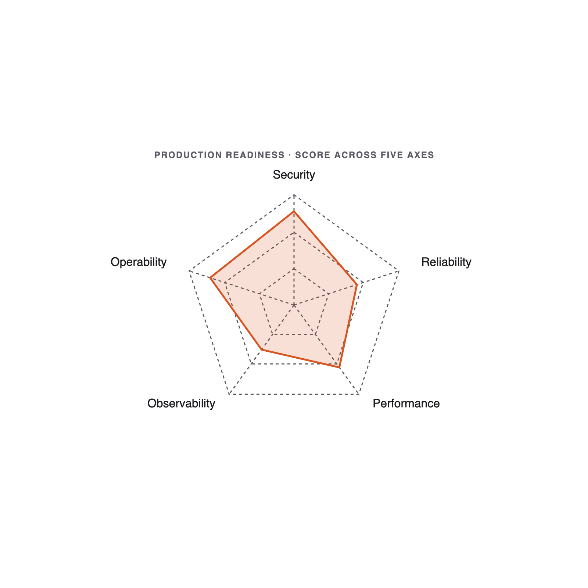

# 10. Production Readiness

Module 10 · 18 min

## Production Readiness

**"It runs on my laptop" is not "ready to ship." Make the call across five axes.**

### Theory · Five axes + a verdict (4 min)

Score every shipping candidate on five axes that **always** matter:

> **Security · Observability · Deployment · Runbooks · Rollback**

- For each axis: one **status** (🟢/🟡/🔴) · one **biggest risk** · one **smallest next step**.
- Use `skills/production-readiness-review/SKILL.md` as the durable instrument.
- **Go / no-go is a decision, not a vibe.** End with a verdict and a ≤ 25-word rationale.

### The five readiness axes



**Security · Observability · Deployment · Runbooks · Rollback** → one go/no-go verdict.

### Reference · Overeager agents (May 2026)

arXiv **2605.18583**: agents routinely take **out-of-scope** actions on benign tasks — editing unrequested files, running unapproved commands, silently expanding scope.

**Defences, in order:**

- **Least-privilege tools** — grant only what this task needs.
- **Permission modes** — `ask` for shell · `deny` for network · `read-only` zones.
- **Shell approval** — every command requires a tap until trust is earned.
- **Review before commit** — diff-first, always; never `--no-verify`.
- **Disaster recovery** — clean branch, atomic commits, easy `git reset --hard`.

### Reference · Common mistakes

- "All green, ready to ship" — almost never true after one workshop; be honest.
- Vague next steps ("improve security") instead of one concrete action.
- 4-page reports — one page or it doesn't get read.
- Skipping the verdict entirely.

### Live demo · Score the Notes API (4 min)

1. Pick the Module 4 Notes API.
2. Paste the assessment prompt:

```text
Assess this repo for production readiness across 5 axes: Security, Observability,
Deployment, Runbooks, Rollback. Status per axis + biggest risk + a go/no-go verdict.
```

3. Walk the class through the 5-axis output; mark two red, three amber, none green.
4. State the go / no-go with the smallest next step.

**Success signal**: an honest verdict with one concrete Monday-morning action.

### Your turn · Production Readiness Report (8 min)

**Exercise**: [`exercises/part-10/README.md`](#hands-on-exercise--module-10)

Pick **one** project from today (likely Module 4) and assess it:

- Run the production-readiness skill against it.
- One page: 5 axes, each with **status · biggest risk · smallest next step**.
- End with a decisive **go / no-go** verdict (≤ 25-word rationale).

**Deliverable**: `module-10/production-readiness-report.md`.

**Success signal**: all five axes covered + an honest verdict + one concrete next step.

### Done & next (1 min)

**Definition of done**

- [ ] All 5 axes covered.
- [ ] Honest go / no-go verdict with ≤ 25-word rationale.
- [ ] One concrete Monday-morning step.

**Next** — that's the loop, ten times over. We close with Q&A and Monday.
**Part 11 — Q&A & Next Steps.**

## Hands-on exercise — Module 10 {#hands-on-exercise--module-10}

> **Companion repository** — Work this exercise from the live files in the [Claude Code Bootcamp repository](https://github.com/lucab85/Claude-Code-Bootcamp): [`exercises/part-10/README.md`](https://github.com/lucab85/Claude-Code-Bootcamp/blob/main/exercises/part-10/README.md).
> Reference solution: [`exercises/part-10/solution/README.md`](https://github.com/lucab85/Claude-Code-Bootcamp/blob/main/exercises/part-10/solution/README.md).

## Module 10 — Production Readiness Report

### Goal

Pick one project from today and write a one-page **Production Readiness Report** with a go / no-go verdict.

### Scenario

Hiring managers and tech leads want to know: would you ship what you built? Today you answer that, honestly, across 5 axes.

### Starter instructions

1. Pick one module you'd actually be willing to defend. The Notes API (module 4) is the typical pick.
2. Open `skills/production-readiness-review/SKILL.md`.
3. Create `module-10/`.

### Claude Code prompt to use

```text
PRODUCTION READINESS
Use the production-readiness-review skill against the project at <path>.

For each of the 5 axes (Security, Observability, Deployment, Runbooks, Rollback):
- One sentence answering: would this hold up in production this week?
- The single biggest risk.
- The single smallest next step that materially reduces the risk.

End with a one-line go / no-go verdict and the rationale (≤ 25 words).
```

### Manual validation steps

1. Open `production-readiness-report.md`.
2. Confirm 5 axes present, each with status + risk + next step.
3. Confirm the verdict line exists and is decisive ("Go" or "No-Go" — not "maybe").
4. Confirm rationale is ≤ 25 words.

### Expected deliverable

```text
module-10/
└── production-readiness-report.md
```

### Definition of done

- [ ] All 5 axes covered: Security, Observability, Deployment, Runbooks, Rollback.
- [ ] Each axis has status, biggest risk, smallest next step.
- [ ] Verdict line: Go / No-Go.
- [ ] Rationale ≤ 25 words.
- [ ] Report fits on one page.

### Stretch challenge

For one "yellow" axis, actually do the smallest next step. Commit the change. Document in `module-10/follow-up.md`.

### Troubleshooting

| Symptom | Fix |
|---|---|
| Everything "green" | Be honest. After one workshop, it's not all green. Re-score. |
| Vague next steps | "Improve security" is not a step. "Add input validation to POST /notes" is. |
| Report > 1 page | Trim. One line per axis component if needed. |
| No verdict | The verdict is the point. Add it. |

## Solution — Module 10 {#solution--module-10}

## Reference solution — Module 10

> **Stop**: only open this after you have produced your own `readiness-report.md` against a prior module.

This module's deliverable is a **12-item production-readiness report**. The reference is a worked example against the Module 4 service.

```text
module-10/
└── readiness-report.md        # 12-item report + GO / NO-GO verdict
```

### Reference `readiness-report.md` (against Module 4 FastAPI service)

```markdown
# Production readiness — Module 4 service

Verdict: **NO-GO** (3 blockers).

| # | Item | Status | Evidence | Action if NOT |
|---|---|---|---|---|
| 1 | Secrets hygiene | ✓ | `.env` ignored; no keys in git history (`git log -p \| grep -iE 'api[_-]?key'`). | — |
| 2 | AuthN / AuthZ | ✗ | No auth on `/tasks` endpoints. | Add API-key middleware before public exposure. |
| 3 | Input validation | ✓ | Pydantic models reject empty `title`. | — |
| 4 | Error budgets | ✗ | No SLO defined. | Pick a 99.5% target for `/tasks`; alert on 5xx > 0.5%. |
| 5 | Idempotency | △ | `POST /tasks` not idempotent; client could double-submit. | Add `Idempotency-Key` header. |
| 6 | Observability | ✗ | No structured logs; no traces. | Add `structlog` + OTLP exporter. |
| 7 | Performance | ✓ | p95 < 50ms on 1k tasks (smoke). | — |
| 8 | Backwards compatibility | n/a | First release. | — |
| 9 | Disaster recovery | △ | SQLite file; no backup. | Document daily snapshot to S3. |
| 10 | Rollback | ✓ | Container image tagged per commit; previous tag re-deployable. | — |
| 11 | Permission scope | ✓ | Container runs as non-root UID 1000. | — |
| 12 | Human review | ✓ | This report counter-signed by senior eng. | — |
```

### How the `release-readiness` skill was used

The report was produced by invoking `skills/release-readiness/SKILL.md` with the Module 4 repo as input. The skill's "Outputs" section specifies the exact table shape above.

### Hooks that would have caught the blockers earlier

```json
{
  "hooks": {
    "pre_commit": [
      { "name": "no-secrets", "command": "gitleaks protect --staged" }
    ]
  }
}
```

A `pre_commit` hook running `gitleaks` would have prevented item #1 from ever needing to be on the checklist.

### Definition of done

- [ ] All 12 items addressed with a concrete status.
- [ ] Verdict line at the top: **GO** or **NO-GO** (with blocker count).
- [ ] At least one blocker mapped to an action item with an owner.
