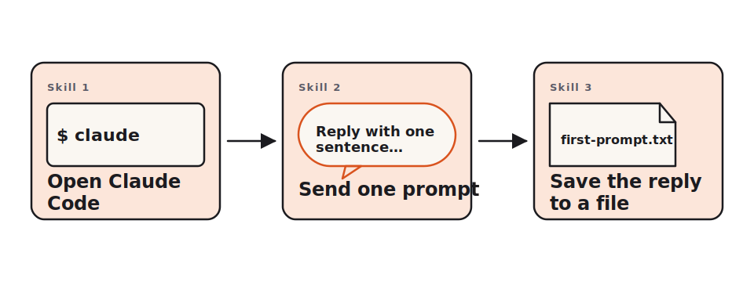

<!-- duration: 20 min -->
<!-- _class: tpl-cover -->
<!-- _paginate: false -->
<!-- _header: "" -->

<span class="module-chip">Module 01 · 20 min</span>

# Meet Claude Code

Claude Code 101 · Beginner Workshop · Module 1 of 8

The first 20 minutes. By the end you will have sent your first prompt and saved the reply.

---

<!-- _class: tpl-objectives -->

## What you'll learn

By the end of this 20-minute lesson you will be able to:

1. Open Claude Code from your terminal.
2. Send one prompt and read the reply.
3. Save the reply into `first-prompt.txt`.

That's it. Three skills. Nothing else.

---

## Why this matters

- Every later lesson assumes you can already get Claude Code to talk back. If this lesson works, the other seven will work.
- Most people fail at AI tools because they never finish the install. Once `claude --version` prints a number on your machine, the hardest part of the whole course is behind you.
- The skill you practice here — **type a prompt, read the reply, save what's useful** — is exactly the loop you'll use in every later module.

---

## The one concept

> **Claude Code is a chat partner in your terminal.**

You type a sentence. It types a sentence back. That's the whole tool.

The only difference from a chat website is that the conversation happens in your terminal, next to your files, so you can ask Claude about your own code later in the course. Today we're not asking about code yet — we're just saying hello.



---

<!-- _class: tpl-show -->

## Show me

Here is exactly what your terminal looks like the first time. The lines that start with `$` are what you type; the rest is what the computer prints back.

```text
$ claude --version
claude-code/1.4.2

$ claude
Welcome to Claude Code. Type a message and press Enter. /exit to quit.

> Reply with one sentence that explains what Claude Code is, written for an absolute beginner.

Claude Code is a small program that runs in your terminal and lets you have a back-and-forth conversation with an AI assistant who can read files, suggest changes, and answer questions about your project.

> /exit
$
```

> If your screen looks like this, you are done with the lesson. Copy the prompt and the reply into `~/first-prompt.txt`.

---

<!-- _class: tpl-try -->

## Try it yourself

Open your terminal and do exactly these three steps:

1. Run `claude --version`. You should see a version line.
2. Run `claude`, paste the prompt below, press Enter.
3. Copy both the prompt and the reply into `~/first-prompt.txt` and save.

The prompt to paste (copy verbatim):

```text
Reply with one sentence that explains what Claude Code is, written for an absolute beginner.
```

Time budget: 5 minutes. If it takes longer than 10, jump to "Common mistakes" below.

---

## Common mistakes

- **Typing the prompt into the wrong place.** The prompt goes after the `>` symbol inside `claude`, not at the regular shell `$` prompt. If you see `command not found: Reply`, you typed at the shell.
- **Forgetting `/exit`.** You stay inside Claude until you type `/exit`. That is not an error, but it's confusing the first time.
- **Saving the file in the wrong folder.** The exercise wants `~/first-prompt.txt` — that means inside your home directory, not the current working directory. On macOS that's `/Users/yourname/`; on Linux that's `/home/yourname/`.
- **Expecting one sentence and getting three.** The model is not perfect. Paste whatever it gave you. Module 03 will teach you how to constrain output.

---

<!-- _class: tpl-done -->

## Lesson reflection

Take 60 seconds and answer in your head:

1. What did Claude reply with that surprised you? (Length, tone, accuracy — anything.)
2. If a friend asked you "what is Claude Code", could you answer in one sentence using only words you used today?
3. Was anything in the install or first-prompt flow confusing? If yes, jot one line into `~/first-prompt.txt` so you remember next time.

There is no right answer here. The reflection itself is the win.

---

<!-- _class: tpl-next -->

## What's next

Module 02 — **Your first real conversation** — picks up where this lesson ends. You will:

- ask Claude follow-up questions in the same session,
- accept and reject what it says,
- and learn how a conversation differs from a single one-shot prompt.

Budget for Module 02: 25 minutes. Take a 5-minute break first if you want one.

---

## Glossary card

- **Claude Code**: The command-line tool from Anthropic that lets you talk to the Claude AI model from your terminal.
- **CLI**: Command-line interface — a program you control by typing commands instead of clicking buttons.
- **Prompt**: The text you send to Claude. One message in the conversation.
- **Terminal**: The text window where you type commands and read their output.
