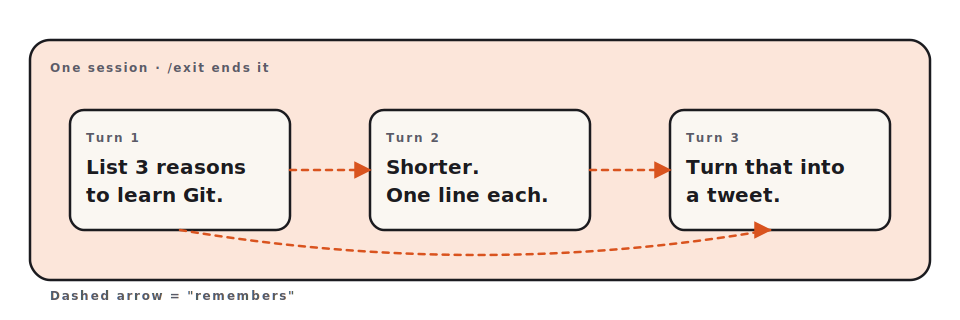

<!-- duration: 25 min -->
<!-- _class: tpl-cover -->
<!-- _paginate: false -->
<!-- _header: "" -->

<span class="module-chip">Module 02 · 25 min</span>

# Your first real conversation

Claude Code 101 · Beginner Workshop · Module 2 of 8

A conversation is more than one prompt. By the end of this lesson you will ask, follow up, and decide what to keep.

---

<!-- _class: tpl-objectives -->

## What you'll learn

By the end of this 25-minute lesson you will be able to:

1. Run a multi-turn conversation in a single Claude Code session.
2. Ask a follow-up that refers to the previous reply.
3. Accept or reject a change Claude proposes.

---

## Why this matters

- Most of the value of Claude Code comes from the second and third prompts, not the first. A single one-shot prompt rarely lands.
- Treating the session as a real conversation lets you correct course cheaply: "Shorter, please." "Use bullets." "Now the same thing in Python."
- Knowing how to **reject** a proposed change is just as important as knowing how to accept one. The whole tool relies on you being the final reviewer.

---

## The one concept

> **Each prompt sees everything you said before — until you exit.**

Inside one `claude` session, all your previous prompts and Claude's previous replies are visible to the model on every new turn. That's why a follow-up like "shorter" works without repeating the original question.

When you type `/exit`, the conversation ends and the next session starts fresh.



---

<!-- _class: tpl-show -->

## Show me

Three turns inside the same session. The user types after `>`; Claude's replies are the indented blocks.

```text
$ claude
> List three reasons a junior developer should learn Git.

1. Track changes over time without losing work.
2. Share code with a team through pull requests.
3. Recover from mistakes by rolling back to a previous commit.

> Shorter. One line each, no numbers.

Track changes safely.
Collaborate through pull requests.
Roll back mistakes easily.

> Turn that into a tweet.

Git is a junior dev's safety net: track changes, collaborate through pull requests, and roll back mistakes easily. #devtools

> /exit
```

Notice that the second and third prompts never repeat "Git" or "junior developer". The session remembered.

---

<!-- _class: tpl-try -->

## Try it yourself

Open Claude Code and run a 3-turn conversation about a topic you actually care about:

1. Ask any open question.
2. Reply with one of: `shorter`, `give me an example`, or `now explain it to a beginner`.
3. Reply with: `summarise that in one sentence`.

Save the whole transcript into `~/three-turns.txt`. The exercise README walks you through it.

Time budget: 8 minutes inside the session, 2 minutes to save the file.

---

## Common mistakes

- **Exiting and reopening between turns.** Each `claude` invocation is a fresh session. Stay inside one session for the whole conversation.
- **Pasting an entirely new question that ignores the previous answer.** That's a new conversation, not a follow-up. If the topic changes, type `/exit` and start over.
- **Accepting a long answer because you feel rude saying "shorter".** Claude does not have feelings. Ask for what you want.
- **Forgetting to scroll up.** The early replies often have the cleanest version of the idea. Don't lose them when you copy.

---

<!-- _class: tpl-done -->

## Lesson reflection

Take 60 seconds:

1. Which follow-up gave you the most improvement: `shorter`, `give me an example`, or `now explain it to a beginner`?
2. Was any reply so far off that you would have rejected it on a real code change?
3. If you had to teach a colleague the "follow-up" idea in one sentence, what would you say?

---

<!-- _class: tpl-next -->

## What's next

Module 03 — **Asking for what you want** — teaches you to load up the first prompt so you need fewer follow-ups. You'll learn role prompts, constraints, and concrete output formats.

Budget for Module 03: 30 minutes.

---

## Glossary card

- **Accept**: Choosing to keep a change Claude proposed.
- **Conversation**: A sequence of prompts and replies in the same Claude Code session.
- **Diff**: The set of lines Claude proposes to add and remove from a file.
- **Reject**: Choosing not to keep a change Claude proposed.
