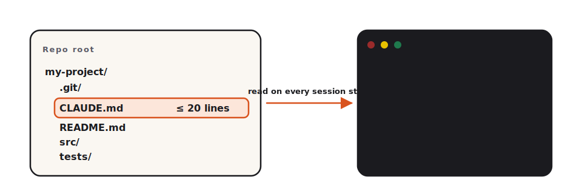

<!-- duration: 25 min -->
<!-- _class: tpl-cover -->
<!-- _paginate: false -->
<!-- _header: "" -->

<span class="module-chip">Module 06 · 25 min</span>

# CLAUDE.md cheat sheet

Claude Code 101 · Beginner Workshop · Module 6 of 8

A 15-line file in your repo can save you 15 prompts a day. Today you write that file.

---

<!-- _class: tpl-objectives -->

## What you'll learn

By the end of this 25-minute lesson you will be able to:

1. Explain what a CLAUDE.md is and why Claude reads it automatically.
2. Write a CLAUDE.md for a small project from a 5-question template.
3. Verify Claude is actually using it by asking a question whose answer is only in the file.

---

## Why this matters

- Every session, Claude is starting cold. Without project context, it asks you the same questions: "What language?", "What's the test command?", "Where do scripts go?".
- CLAUDE.md answers those once, in your repo, where new collaborators (human and AI) both benefit.
- A bad CLAUDE.md is worse than none: it lies to future you. So we keep it short and easy to update.

---

## The one concept

> **CLAUDE.md lives at the repo root. Claude reads it on every session start. Keep it under 20 lines.**

That's it. No special syntax, no special location, no plugin. It's a Markdown file. If `CLAUDE.md` exists at the same level as your `.git` folder, Claude picks it up.

The size cap is for you, not Claude. A 200-line CLAUDE.md never gets updated. A 15-line one does.



---

<!-- _class: tpl-show -->

## Show me

A real, working CLAUDE.md for a small Python notes app — the exact file you'll write in the exercise:

```text
# Project: notes

Tiny CLI for personal notes. Single file, no dependencies.

**Stack**
- Python 3.11+, standard library only.
- Tests: `pytest -q`.

**Commands**
- Run: `python notes.py <subcommand>`.
- Test: `pytest -q`.
- Lint: `python -m py_compile notes.py`.

**Conventions**
- One file: `notes.py`. Do not split.
- Persistence: `notes.json` in the current directory.
- No third-party packages. Ever.
```

15 lines. Every line is useful. Claude will not need to ask you what the test command is again.

---

<!-- _class: tpl-try -->

## Try it yourself

[`exercises/beginner/part-06/starter/`](../../exercises/beginner/part-06/starter/) contains a minimal `notes.py` and an empty `CLAUDE.md`. Your job: fill in the CLAUDE.md by answering the five questions in the exercise, then prove Claude is using it by asking a project-specific question.

Time budget: 12 minutes.

---

## Common mistakes

- **Writing a manifesto.** "We believe in clean code, pragmatic engineering, and continuous improvement." Delete that. Claude needs facts, not values.
- **Listing every command in your `package.json`.** Pick the 3 commands a new collaborator would need on day one.
- **Stale facts.** If you rename your test command, update CLAUDE.md the same commit. Treat it like the README.
- **Putting secrets in it.** It's checked into Git. No keys, no tokens, no internal URLs.

---

<!-- _class: tpl-done -->

## Lesson reflection

Take 60 seconds:

1. Could a new team member skim your CLAUDE.md in 30 seconds and know what to run?
2. Is there anything in it that would be wrong if you renamed the test command tomorrow? Fix that.
3. Did Claude actually behave differently after you saved the file? If not, did you save it in the repo root?

---

<!-- _class: tpl-next -->

## What's next

Module 07 — **Safer & smarter** — covers the things never to paste into Claude: secrets, customer data, anything you'd be embarrassed to email.

Budget for Module 07: 25 minutes.

---

## Glossary card

- **CLAUDE.md**: A short Markdown file at the root of your project that tells Claude Code your house rules.
- **Project context**: Information about your project (often in CLAUDE.md) that you give Claude so its answers fit your codebase.
