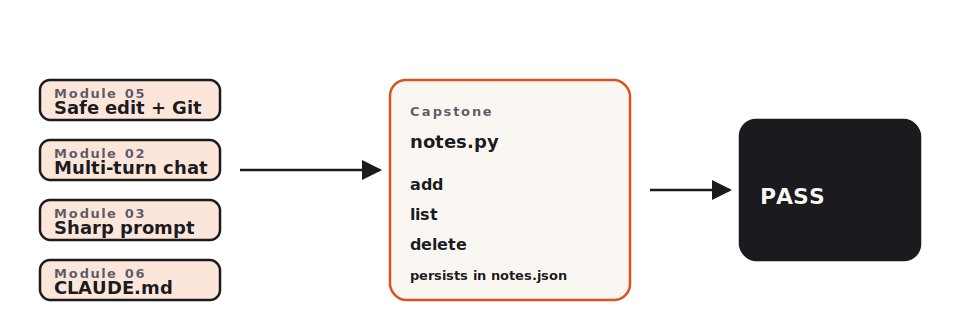

<!-- duration: 30 min -->
<!-- _class: tpl-cover -->
<!-- _paginate: false -->
<!-- _header: "" -->

<span class="module-chip">Module 08 · Capstone · 30 min</span>

# Putting it together

Claude Code 101 · Beginner Workshop · Module 8 of 8

This is the capstone. You build a real, runnable CLI, and a script grades it.

---

<!-- _class: tpl-objectives -->

## What you'll learn

By the end of this 30-minute lesson you will be able to:

1. Combine Module 02 (conversation), Module 03 (clear prompt), Module 05 (safe edit), and Module 06 (CLAUDE.md) into one workflow.
2. Build `notes.py` — a Python CLI with `add`, `list`, and `delete` subcommands that persist between runs.
3. Verify your work with `scripts/check-beginner-capstone.sh`, which prints `PASS <token>`.

---

## Why this matters

- Every prior module taught one skill in isolation. The capstone is where the skills stack: you write a CLAUDE.md, you ask a sharp prompt, you commit before editing, you redact anything sensitive.
- A graded capstone gives you a real artifact — and a real token — to put on your workshop certificate.
- Building one tiny end-to-end thing teaches more than reading ten tutorials about parts of it.

---

## The one concept

> **One file. Three subcommands. Persistence in `notes.json`. Graded by a script.**

The full contract:

| Command | stdout | Exit |
|---|---|---|
| `python notes.py add "hello"` | `added: 1` | 0 |
| `python notes.py list` | `1\thello` (one row per note) | 0 |
| `python notes.py delete 1` | `deleted: 1` | 0 |
| `python notes.py list` (after delete) | _(empty)_ | 0 |
| anything else | usage line on stderr | 2 |

State persists in a `notes.json` file in the current directory. IDs increase monotonically — deleting note 1 does **not** make the next `add` reuse id 1.



---

<!-- _class: tpl-show -->

## Show me

A full successful run:

```text
$ python notes.py add "buy milk"
added: 1
$ python notes.py add "call mum"
added: 2
$ python notes.py list
1	buy milk
2	call mum
$ python notes.py delete 1
deleted: 1
$ python notes.py list
2	call mum
$ python notes.py add "feed cat"
added: 3
```

Notice the new note gets id 3, not 1. That is the persistence + monotonic-id rule.

---

<!-- _class: tpl-try -->

## Try it yourself

[`exercises/beginner/part-08/starter/`](../../exercises/beginner/part-08/starter/) has a stub `notes.py`, a `CLAUDE.md`, and a README that walks you through the full workflow.

Time budget: 22 minutes (this is the longest exercise; pace yourself).

The grading command, when you're done:

```sh
scripts/check-beginner-capstone.sh exercises/beginner/part-08/starter/notes.py
# expected output: PASS abc12345
```

That 8-character token goes on your certificate.

---

## Common mistakes

- **Skipping CLAUDE.md.** Without it, Claude will ask which Python version, whether to use dataclasses, etc. Write CLAUDE.md first.
- **Reusing IDs after delete.** The grader specifically checks that the next `add` after a `delete 1` returns `2` (or higher), not `1`.
- **Trailing whitespace in stdout.** The grader compares stdout exactly. `added: 1 ` (with trailing space) will fail.
- **Skipping the `git commit` before edits.** When something breaks, you'll want `git restore` (Module 05) more than you think.
- **Adding dependencies.** Stdlib only. `import json`, `import sys`, `import pathlib` — that's it.

---

<!-- _class: tpl-done -->

## Lesson reflection

Take 2 minutes:

1. Which earlier module did you lean on the most: 02, 03, 05, or 06?
2. What did the grader catch that you hadn't noticed?
3. If a colleague asked you to teach them Claude Code in 4 hours, which 3 of these 8 modules would you keep?

---

<!-- _class: tpl-next is-finale -->

## What's next

You've finished the Claude Code 101 beginner workshop. Two paths from here:

- **Use it on a real project.** Pick something small you actually need. Apply the role + goal + constraint + format prompt pattern. Commit before edits. Redact secrets.
- **Go deeper.** The intermediate course — [`001-bootcamp-course-materials`](../../specs/001-bootcamp-course-materials/) — is the next step in this curriculum. It covers multi-file edits, automated testing, custom slash commands, and production workflows.

Render your certificate per the instructions in [`beginner-student-guide.md`](../../beginner-student-guide.md). Workshop complete.

---

## Glossary card

- **Capstone**: The final hands-on project at the end of Module 08.
- **Persistence**: Saving data to a file so it survives between program runs.
- **Subcommand**: A second word after the main command, such as `add` in `notes.py add`.
