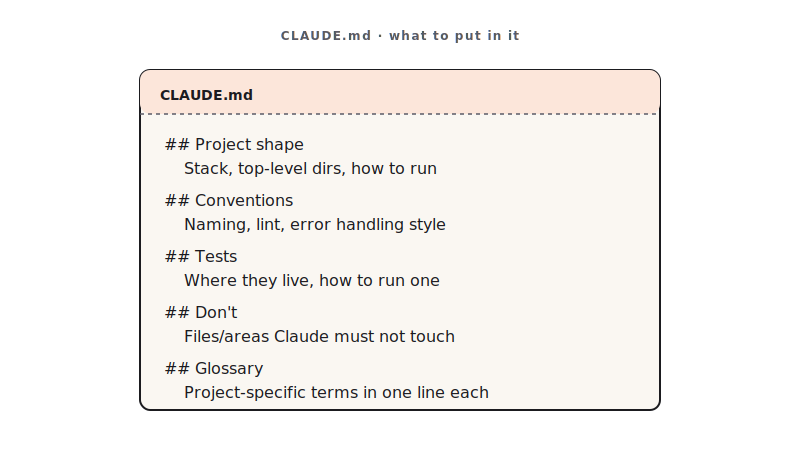

<!-- duration: 22 min -->
<!-- _class: tpl-cover -->
<!-- _paginate: false -->
<!-- _header: "" -->

<span class="module-chip">Module 03 · 22 min</span>

# Project Context with CLAUDE.md

**Stop re-explaining your stack. Write it once; Claude reads it every prompt.**


<!--
SPEAKER NOTES — slide 1 (hook, 60 sec)
- One line: "CLAUDE.md is the difference between coaching a new hire every morning and one good onboarding doc."
-->

---

<!-- _class: tpl-objectives -->

## Theory · CLAUDE.md is a behavior file (4 min)

`CLAUDE.md` lives at the repo root. Claude reads it **automatically on every prompt**.

> It is a *behavior* file, not documentation. Every line must change Claude's output.

Five sections earn their place:

- **Stack** — languages, versions, frameworks.
- **Conventions** — naming, layout, lint rules.
- **Commands** — exact build / test / run / lint.
- **Do-not** — hard lessons, the traps.
- **Glossary** — domain terms only your team uses.

**Trim test**: delete a section; if Claude behaves the same, it was bloat. Aim **under 80 lines**.

<!--
SPEAKER NOTES — slide 2 (theory, 4 min)
- Hammer the README vs CLAUDE.md split: nice-to-know -> README; changes-output -> CLAUDE.md.
-->

---

<!-- _class: tpl-show -->

## CLAUDE.md at a glance



Five sections — **Stack · Conventions · Commands · Do-not · Glossary** — under 80 lines.

<!--
SPEAKER NOTES — slide 3 (diagram, 1 min)
- Each box is a section; the file on the next slide is this picture as text.
-->

---

<!-- _class: tpl-show -->

## Reference · A lean CLAUDE.md (≤ 80 lines)

```text
# CLAUDE.md

## Stack
- Python 3.11, standard library only.

## Conventions
- snake_case files; one command per module under cli/.
- Lint: ruff. Format: black.

## Commands
- Test:  pytest -q
- Run:   python -m taskcli
- Lint:  ruff check .

## Do-not
- Do NOT add third-party deps without asking.
- Do NOT swallow exceptions; surface exit codes.
```

Template: [`skills/claude-md-template/SKILL.md`](../skills/claude-md-template/SKILL.md).

<!--
SPEAKER NOTES — slide 3 (reference, 1 min)
-->

---

<!-- _class: tpl-show -->

## Reference · A complete CLAUDE.md (all 5 sections)

```text
# CLAUDE.md — Notes API

## Stack
- Python 3.11 · FastAPI · Pydantic v2 · SQLite (stdlib sqlite3).
- Tests: pytest + httpx. Lint: ruff. Format: black.

## Conventions
- snake_case modules; routes in app/routers/, models in app/models.py.
- One Pydantic model per resource; never return ORM rows directly.
- HTTP status: 201 create · 200 read/update · 204 delete · 404 · 422.

## Commands
- Test:  pytest -q
- Run:   uvicorn app.main:app --reload
- Lint:  ruff check . && black --check .

## Do-not
- Do NOT add deps without asking — stdlib + the four above only.
- Do NOT swallow exceptions; raise HTTPException with a clear detail.
- Do NOT write to the DB outside a repository function.

## Glossary
- "note": {id, title, body, created_at} — body may be empty, title may not.
- "winner": the Best-of-N candidate chosen in Module 4.
```

Every line changes Claude's output. Still under 80 lines.

<!--
SPEAKER NOTES — slide 4 (reference, 1 min)
- This is the "good example" — point out each section earns its place.
- Glossary is short on purpose: only terms unique to THIS team/repo.
- Contrast with the lean version on the previous slide: same shape, more teeth.
-->

---

<!-- _class: tpl-show -->

## Reference · Common mistakes

- Writing an `ABOUT.md` (documentation) instead of a behavior file.
- 200 lines of bloat instead of a lean 80.
- Skipping **Do-not** — and not committing the file (if it's not in git, it isn't real).

<!--
SPEAKER NOTES — slide 5 (common mistakes, 30 sec)
Instructor cues:
- Run the trim test live: delete a section, re-prompt, watch the drift.
-->

---

<!-- _class: tpl-show -->

## Live demo · Before vs. after CLAUDE.md (5 min)

**The prompt — run it twice, unchanged (before, then after):**

```text
Add an `--export csv` flag to the task CLI that writes all tasks
to a file. Match the project's existing conventions.
```

1. Run it on the Module 2 repo with **no** `CLAUDE.md` → off-convention output.
2. Drop in a 12-line `CLAUDE.md`; in a **fresh chat**, paste the **same** prompt → now follows conventions.
3. Trim test: delete one section, re-prompt, observe the drift.

**Success signal**: with `CLAUDE.md` present, Claude matches your naming/layout without being told.

<!--
SPEAKER NOTES — slide 6 (demo, 5 min)
- Fresh chat matters — show that the file, not the chat history, carries the rules.
-->

---

<!-- _class: tpl-try -->

## Your turn · Author your CLAUDE.md (10 min)

**Exercise**: [`exercises/part-03/README.md`](../exercises/part-03/README.md)

Write a `CLAUDE.md` for your Module 2 repo (or a personal repo):

- All five sections: **Stack · Conventions · Commands · Do-not · Glossary**.
- **Under 80 lines.** Run the **trim test** at least once.

**Prompt**: *"Read this repo and draft a CLAUDE.md with Stack, Conventions, Commands, Do-not, Glossary. Keep it under 80 lines; every line must change your behavior."*

**Success signal**: on the next prompt, Claude obeys one convention you wrote — capture a proof screenshot.

<!--
SPEAKER NOTES — slide 7 (hands-on, 10 min)
- Catch students pasting README prose. Ask: "does this line change Claude's output?" If no, cut it.
-->

---

<!-- _class: tpl-done -->

## Done & next (1 min)

**Definition of done**

- [ ] `CLAUDE.md` < 80 lines, all five sections, committed to git.
- [ ] Trim test performed at least once.
- [ ] Proof screenshot of Claude obeying one convention.

**Next** — with rules in place, we generate *several* solutions and pick the best.
**Module 4 — Build Faster with Best-of-N.**

<!--
SPEAKER NOTES — slide 8 (wrap, 1 min)
-->

<!-- polish-log
2026-05-28 · lean instructor-pacing shape (matches Module 1 pilot).
cover -> theory (behavior file) -> reference (sample · mistakes) -> live demo -> your turn -> done.
-->
