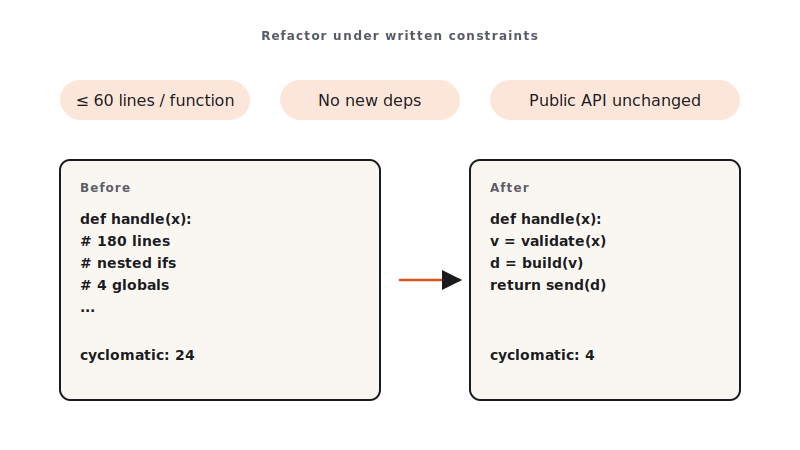

<!-- duration: 24 min -->
<!-- _class: tpl-cover -->
<!-- _paginate: false -->
<!-- _header: "" -->

<span class="module-chip">Module 08 · 24 min</span>

# Refactoring & Documentation at Scale

**Refactor under written constraints. Document from the diff — never from the prompt.**


<!--
SPEAKER NOTES — slide 1 (hook, 60 sec)
- One line: "Unconstrained, Claude rewrites everything. Constrained, it makes a surgical diff."
-->

---

<!-- _class: tpl-objectives -->

## Theory · Constrained refactor + two-pass docs (4 min)

> **Tell Claude what may NOT change**: public API, file count, runtime behavior.

- **Two-pass workflow** — keep them separate:
  - **Pass 1**: refactor for readability only.
  - **Pass 2**: generate docs **from the diff**.
- **`HANDOFF.md`** — one-pager for the next engineer: what changed · why · risk · watch-outs.
- **`ARCHITECTURE.md`** — component shape, data flow, **one** diagram (ASCII is fine), known limits.

**Combine the two passes and the docs describe your prompt, not the code.**

<!--
SPEAKER NOTES — slide 2 (theory, 4 min)
- constraints.md is the lab's load-bearing artefact. No constraints = no lab.
-->

---

<!-- _class: tpl-show -->

## Refactor inside the guardrails



**constraints.md** fixes what must NOT change — write it *before* you touch the code.

<!--
SPEAKER NOTES — slide 3 (diagram, 1 min)
- Left half = guardrails; right half = the two doc passes.
-->

---

<!-- _class: tpl-show -->

## Reference · constraints.md (write it first)

```text
# Refactor constraints

## May change
- Internal function structure, names, early returns.

## Must NOT change
- Public function signatures / CLI flags.
- File count (no new modules).
- Observable runtime behavior — tests must stay green.

## Style
- Replace nested conditionals with early returns.
- No comments unless they explain *why*.
```

<!--
SPEAKER NOTES — slide 3 (reference, 1 min)
-->

---

<!-- _class: tpl-show -->

## Reference · Common mistakes

- Skipping `constraints.md` → Claude rewrites everything → lab spent reading.
- Combining refactor + docs in one prompt → docs describe the prompt.
- Vetoing every unrequested change (some are fine — read the diff).
- 200-line `ARCHITECTURE.md` (trim aggressively).

<!--
SPEAKER NOTES — slide 4 (common mistakes, 30 sec)
Instructor cues:
- Show the bad (unconstrained) diff first, then the constrained one.
-->

---

<!-- _class: tpl-show -->

## Live demo · Bad vs. constrained refactor (5 min)

1. Open `exercises/part-08/before/` (messy). Show the **unconstrained** refactor → bloated diff.
2. Reset. Paste the **constrained** prompt:

```text
Refactor for readability only, obeying constraints.md exactly. Do not change
public signatures, file count, or behavior. Tests must stay green. Show the diff.
```

3. Run tests → still green.
4. Pass 2: generate `HANDOFF.md` from the diff; read it aloud.

**Success signal**: the constrained diff respects every line of `constraints.md` and tests stay green.

<!--
SPEAKER NOTES — slide 5 (demo, 5 min)
-->

---

<!-- _class: tpl-try -->

## Your turn · Refactor + handoff docs (12 min)

**Exercise**: [`exercises/part-08/README.md`](../exercises/part-08/README.md)

1. Copy the messy module to `module-08/after/`.
2. Write `constraints.md` **before** touching code.
3. Refactor for readability only; re-run the existing tests (must stay green).
4. Pass 2 — generate `HANDOFF.md` and `ARCHITECTURE.md` from the diff.

**Success signal**: tests green · diff respects every constraint · both docs within length limits.

<!--
SPEAKER NOTES — slide 6 (hands-on, 12 min)
- Catch students who refactor before writing constraints.md. 3-min warning.
-->

---

<!-- _class: tpl-done -->

## Done & next (1 min)

**Definition of done**

- [ ] Tests still green; diff respects every constraint.
- [ ] `HANDOFF.md` ≤ 40 lines, all four sections.
- [ ] `ARCHITECTURE.md` ≤ 80 lines, has a diagram + component paragraphs.

**Next** — we graduate from prompts to *agentic engineering*: Skills, Hooks, MCP, multi-agent.
**Module 9 — Skills, Hooks, MCP & Multi-Agent Workflows.**

<!--
SPEAKER NOTES — slide 7 (wrap, 1 min)
-->

<!-- polish-log
2026-05-28 · lean instructor-pacing shape (matches Module 1 pilot).
cover -> theory (constrained refactor + 2-pass) -> reference (constraints.md · mistakes) -> live demo -> your turn -> done.
-->
